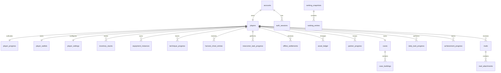

# 《我的修仙日记》游戏设计与技术规范

> 本文档是《我的修仙日记》的唯一需求与技术基线。玩法、客户端、服务端、数据库、接口和测试均以本文档为准。实现与本文档冲突时，应先修改本文档并记录变更，再修改代码。

## 0. 文档信息

| 项目 | 内容 |
|---|---|
| 文档版本 | `0.11.0` |
| 文档状态 | 基线已冻结；第一阶段进行中，核心修炼、挂机资产、角色档案、背包/收获箱、基础道具使用、功法/法宝装备、前后台生命周期、当前会话断网只读、缓存离线启动、离线装备操作队列、升级/突破/战力表现闭环、开发诊断面板、离线时间模拟及固定资源注入已完成，平台验收仍未完成 |
| 最后更新 | 2026-08-06（Asia/Shanghai） |
| 游戏名称 | 我的修仙日记 |
| 内部标识 | `cultivation-diary` |
| 客户端 | Cocos Creator 3.8.8 + TypeScript |
| 发布目标 | 微信小游戏，由 Cocos 构建后导入微信开发者工具运行、真机测试和发布 |
| 后端 | Node.js + TypeScript + Fastify |
| 数据层 | PostgreSQL + Redis |
| 当前部署范围 | 仅保证前后端本地开发、联调和测试；正式部署方案延期决定 |

### 0.1 规范用语

- “必须”：验收所需的强制要求。
- “应”：默认实现方式，只有在记录技术决策后才能变更。
- “可以”：可选能力，不阻塞当前阶段验收。
- “初始配置”：首版可执行数值，不写死在业务代码中，允许通过平衡测试调整。
- “服务端权威”：最终结果由服务端计算和持久化，客户端结果仅用于预览和动效。

### 0.2 需求编号

需求使用稳定编号，代码、提交、测试和缺陷记录应引用对应编号。

| 前缀 | 范围 |
|---|---|
| `PRD` | 产品与阶段范围 |
| `AUTH` | 登录、账号、角色身份 |
| `NAV` | 页面与导航 |
| `CUL` | 修炼、经验、升级、突破、战力 |
| `ECO` | 货币与产出消耗 |
| `OFF` | 离线结算与弱网同步 |
| `INV` | 背包、道具、挂机收获箱 |
| `TECH` | 功法系统 |
| `EQP` | 法宝系统 |
| `PARTNER` | 伴侣系统 |
| `RANK` | 排行榜 |
| `CAVE` | 洞府系统 |
| `TASK` | 任务与成就 |
| `DUN` | 副本与挑战 |
| `CLIENT` | Cocos 客户端架构 |
| `SERVER` | Node.js 服务端架构 |
| `DB` | PostgreSQL/Redis 数据设计 |
| `API` | 网络接口与协议 |
| `ASSET` | 美术、音频和资源规范 |
| `TEST` | 测试与验收 |

### 0.3 已确认决策

| 编号 | 决策 |
|---|---|
| `DEC-001` | Cocos Creator 直接构建微信小游戏，不采用普通微信小程序 `web-view` 方案。 |
| `DEC-002` | 四个底部 Tab 始终显示；系统未解锁时进入锁定说明页，不动态移除 Tab。 |
| `DEC-003` | 境界最高等级的经验条必须修满后才可手动突破。 |
| `DEC-004` | 境界瓶颈期间经验停止，灵石、材料和挂机掉落继续产出。 |
| `DEC-005` | 首版突破必定成功，只校验材料；不实现突破失败概率。 |
| `DEC-006` | 初期、中期、后期、圆满仅为等级称号，不是独立养成层。 |
| `DEC-007` | 经验倍率与战力倍率分离；原大倍率用于境界战力。 |
| `DEC-008` | 首版软上限为 Lv.1000，服务器配置可在后续开放更高等级。 |
| `DEC-009` | 灵石基础产出由“等级点/秒”改为“等级点/分钟”。 |
| `DEC-010` | 基础离线收益自动到账并弹窗汇总，不要求手动领取。 |
| `DEC-011` | 登录使用微信授权；一个微信账号自动初始化一个角色。 |
| `DEC-012` | 游戏角色名称全服唯一。 |
| `DEC-013` | 后端采用 Node.js + TypeScript + Fastify 的模块化单体。 |
| `DEC-014` | 当前只设计和开发前后端，不处理正式云部署。 |
| `DEC-015` | 美术资源当前为空，先使用最终尺寸的原创占位资源，后续统一替换。 |

### 0.4 实施快照

截至 2026-08-06，第一阶段工程状态如下：

| 范围 | 状态 | 已验证内容 |
|---|---|---|
| 工程工作区 | 已完成 | 保留 Cocos Creator 根项目，建立 `pnpm` 工作区、统一 TypeScript 配置和本地依赖编排。 |
| 共享领域规则 | 已完成首批 | 境界、阶段称号、经验需求、在线收益、自动升级、境界瓶颈、突破、灵石、掉落时钟、离线时长和大数显示均有纯函数实现。 |
| 服务端底座 | 已完成首批 | Fastify 应用、环境校验、稳定错误响应、健康检查、受限 CORS、OpenAPI、PostgreSQL/Redis 连接和优雅停机已实跑。 |
| 第一阶段数据库结构 | 已完成 | 15 张核心表、外键、检查约束和唯一索引已完成空库迁移、重复迁移和数据库实查。 |
| 认证、角色初始化与档案 | 已完成首批 | 模拟登录、微信换码适配边界、自动建号、全服唯一原创道号、JWT、刷新令牌轮换、幂等登录和 bootstrap 已实现；首次主角形象选择、一次免费改名、改名卡消费、旧名 7 日保留及并发唯一性保护已形成服务端闭环。微信真实换码等待 AppID/AppSecret。 |
| 自动化验证 | 已通过 | 共享领域 29 项、服务端及客户端单元 110 项、PostgreSQL 集成 26 项，共 165 项测试通过；第一阶段逐项验收清单完成 44/49；全工程类型检查、服务端构建及生产依赖审计通过。 |
| Cocos 客户端底座 | 已完成首批 | 启动场景入口、平台适配、API 客户端、Store、固定四 Tab、个人档案入口、角色形象确认、改名输入、锁定页和代码绘制占位主视觉已落地；资产 mutation 携带角色版本并在冲突时同步快照；正式 30 秒 heartbeat、绑定账号与角色身份及版本的 v3 权威快照缓存写入/校验/冷启动读取、后台先缓存再尽力同步及前台立即恢复已接通；浏览器和微信网络状态监听、10 秒请求超时、在线/重连/离线状态、最近同步时间、缓存快照只读保护及联网自动恢复已接通；离线功法/法宝装备队列会与权威基线原子持久化，并在重连结算后按固定幂等键和版本顺序回放或明确回滚；升级、突破和战力变化由服务端证据驱动，表现层使用持久双根节点、排队合并和可中断 Node-target tween；开发构建增加诊断面板、真实服务端离线 1/8/24 小时模拟及固定经验/资源注入，生产构建不创建调试节点；浏览器已完成登录、离线汇总、背包/收获箱及功法/法宝装备、替换、卸下实测，四类资产列表现可完整分页操作。 |
| 修炼纵向闭环 | 已完成第一阶段基础闭环 | 服务端权威在线/离线分段结算、90 秒在线宽限、70% 基础离线效率、24 小时上限、自动升级、灵石余数、Lv.8 突破丹奖励、Lv.10 瓶颈、事务突破和幂等重放均已接通；挂机尝试会按版本化掉落表生成材料、强化石、法宝、功法和突破丹，并按在线/离线效率统一结算。 |
| 资产与基础养成 | 已完成第一阶段基础闭环 | 50→200 格扩包、100 格收获箱、转移、分解、满箱品质保护、小经验丹使用、功法收录/重复本、四类功法装备及六部位法宝装备已接通；每次装备变化由服务端重算战力及经验、灵石、掉落效率。 |
| 下一开发项 | 待继续 | 进入仍依赖外部环境的微信开发者工具和真机验收；网络故障模拟、固定随机种子和测试账号清理等其余调试控制另行开发。 |

本节只记录已验证的实现进度。玩法和技术行为仍以正文需求编号为准；每完成一个实施阶段，应同步更新本节和 `32.1` 变更记录。

### 0.5 功能完成状态总览

状态标记统一使用以下口径：

- `✅ 已完成`：代码、接口或界面已经落地，并至少通过类型检查、自动化测试或真实运行验证之一。
- `🟡 部分完成`：已有纯函数、数据库表、只读快照或占位界面，但尚未形成可验收业务闭环。
- `⬜ 未完成`：第一阶段要求存在，但当前没有可用实现。
- `⛔ 外部阻塞`：代码适配已存在，仍需要平台凭据、开发者工具或外部环境才能验收。
- `⏸ 规划延期`：按阶段规划不属于当前第一阶段完整功能，不计为当前缺陷。

数据库中已有表不等于对应玩法已完成；只有能够通过服务端 mutation 持久化、客户端操作并完成验收的功能才标记为 `✅`。

| 功能范围 | 状态 | 当前已经完成 | 仍未完成或尚未验收 |
|---|---|---|---|
| pnpm/Cocos/服务端工作区 | ✅ 已完成 | 工作区、统一类型检查、共享包、服务端构建、本地依赖编排和 GitHub Actions 验证流水线可用 | 正式部署与发布流水线按规划延期 |
| Fastify 服务端底座 | ✅ 已完成 | 环境校验、健康检查、统一错误、受限 CORS、OpenAPI、PostgreSQL/Redis 连接和优雅停机 | Redis 目前只用于连接与健康检查，尚无游戏业务缓存/队列 |
| 第一阶段数据库结构 | ✅ 已完成 | 15 张核心表、迁移、外键、检查约束、唯一索引已实跑；第一阶段资产表已有事务写入链路 | 后续阶段的邮件、排行、副本等业务仍未进入当前 15 表范围 |
| 开发登录、角色初始化与档案 | ✅ 已完成 | 开发账号登录、自动建号、唯一道号、JWT、刷新轮换、幂等登录、Bootstrap、首次主角形象二选一，以及受唯一性和旧名保留保护的免费/改名卡改名 | 后续再次改变主角形象的消耗规则按运营配置延期 |
| 微信登录 | 🟡 部分完成 / ⛔ 外部阻塞 | 微信 `code` 换取身份的适配边界和客户端 `wx.login` 路径已实现 | 缺 AppID/AppSecret，未完成真实微信换码、账号实测和异常场景验收 |
| Cocos 客户端底座 | ✅ 已完成 | 启动入口、平台适配、API 客户端、Store、加载/错误页、四 Tab、个人档案面板、首次形象确认、改名输入、锁定页、版本校验与冲突恢复；正式 heartbeat、绑定账号与角色身份及版本的 v3 权威快照缓存写入/校验/冷启动只读恢复、前后台生命周期同步、断网/重连提示、最近同步时间、经济操作只读保护和联网自动恢复已接通；离线功法/法宝装备乐观队列可持久化、顺序重放或明确回滚；升级/突破/战力表现由明确服务端证据触发，面板和动画在切页、切后台、角色切换时可中断；开发构建提供诊断面板、离线 1/8/24 小时模拟和“修满本级 / 灵石 +1万 / 突破丹 +1”固定注入，生产构建不创建调试节点 | 任意等级/战力改写、功法/法宝发放、网络故障、固定随机种子和测试账号清理等调试控制仍未实现 |
| 在线修炼与自动升级 | ✅ 已完成 | 服务端分段结算、等级变速、合法溢出、灵石微量余数、掉落尝试时钟、五类独立随机掉落和正式 30 秒 heartbeat | 限时效果及跨配置版本的长区间分段随对应后续系统交付；heartbeat 增量轻量化仍待优化 |
| 境界瓶颈与突破 | ✅ 已完成 | Lv.10 瓶颈、Lv.8 突破丹奖励、缺丹回滚、突破事务、旧境界预结算、Lv.11 解锁和幂等并发保护；成功响应触发雷劫和境界揭示表现 | 正式美术资源和微信真机验收未完成 |
| Lv.1000 版本上限 | 🟡 部分完成 | 共享状态机与服务端结算均可进入并持久化 `version_cap`，同时累积修为储备 | 缺专项集成测试、客户端专用文案/界面和端到端验收 |
| 基础经济 | 🟡 部分完成 | 灵石产出、余额、累计收入、资产流水、突破丹堆叠和小经验丹使用已接通 | 仙玉来源、动态奖励箱、主要经济出口和其他通用道具使用未实现 |
| 正式离线收益 | ✅ 第一阶段基础闭环完成；⏸ 扩展延期 | 服务端按权威心跳判定在线/离线，70% 效率统一作用于经验、灵石和掉落时钟，最多发放 24 小时并推进游标；资产、进度、流水和唯一 `offline_settlements` 记录同事务写入，幂等重试不重复发奖；客户端自动到账弹窗已实跑，跨心跳保留且关闭不丢奖励 | 闭关室多级效率、跨限时效果/配置版本分段和激励视频追加奖励尚未实现，随对应后续系统交付 |
| 背包与挂机收获箱 | ✅ 第一阶段基础闭环完成；⏸ 深度管理延期 | 50→200 格事务扩容、堆叠道具、100 格收获箱、收取、主动分解、满箱白绿自动分解、蓝色以上保护、小经验丹使用、完整分页操作、幂等 API 和真实操作面板已完成 | 完整筛选/排序、批量管理和邮件兜底系统随深度养成阶段交付 |
| 功法系统 | ✅ 第一阶段基础闭环完成；⏸ 深度养成延期 | 挂机获取、收获箱收录、重复本累计、列表/四类槽位、装备、替换、卸下，以及战力和修炼效率服务端重算已完成并实跑 | 升星、共鸣、主动分解及完整详情抽屉属于后续养成深度 |
| 法宝系统 | ✅ 第一阶段基础闭环完成；⏸ 深度养成延期 | 挂机随机实例、品质和词条、收获箱入包、六部位展示、饰品左右槽、装备、替换、卸下，以及战力/挂机效率重算已完成并实跑 | 强化、锁定、主动分解、套装、炼器和重铸属于后续养成深度 |
| 新手任务与成就 | 🟡 部分完成 | Lv.8 新手任务会自动完成、自动领奖且不会重复发放 | 完整新手链、任务 UI、每日任务和成就系统未实现 |
| 伴侣页面 | ✅ 第一阶段占位完成；⏸ 完整系统延期 | 未解锁说明页和 Lv.11 后占位页可用 | 结识、亲密度、双修、送礼和主修属于第三阶段 |
| 排行榜页面 | ✅ 第一阶段占位完成；⏸ 完整系统延期 | 固定 Tab 和空榜占位页可用 | 真实榜单、快照、结算奖励属于第三阶段 |
| 洞府页面 | ✅ 第一阶段占位完成；⏸ 完整系统延期 | 未解锁说明页和 Lv.11 后建筑占位页可用 | 建筑、生产、繁荣度和装饰属于第三阶段 |
| 副本、邮件、商业化和运营 | ⏸ 规划延期 | 数据设计和接口边界有预留 | 业务功能尚未开始，分别属于第二至第四阶段 |
| 美术、音频与动效 | 🟡 部分完成 | 当前客户端有代码绘制的原创占位主视觉、金色升级光阵、程序化雷劫、数字插值和基础按钮反馈 | 正式人物/场景/UI 资源、音频和正式粒子资源未制作 |
| 微信小游戏平台验收 | 🟡 部分完成 / ⛔ 外部阻塞 | `0.11.0-r1` 源码已生成完整微信小游戏 debug/release 产物并通过 JavaScript 语法检查；debug 包包含离线 1/8/24 小时和固定资源注入入口，release 包不包含 `DebugRoot`、调试面板标题或按钮文案；此前已静态核验 heartbeat、网络状态监听、请求超时、v3 缓存、离线装备队列状态机、幂等/版本请求头、表现触发及 `GameBootstrap` 场景绑定；`0.3.0` Web 产物曾完成浏览器交互实跑 | 尚未在微信开发者工具和真机完成验收；本机 Cocos 全局 `layout.json`、`window.json` 损坏会导致 CLI 在产物完成后仍以非零码退出 |
| Git 版本基线 | ✅ 已完成 | 已创建并推送首个基线提交 `d9e7b83`，后续变更可以审阅、比较和回滚 | 持续保持小批次提交并由 CI 验证 |

当前第一阶段最优先的未完成链路是：`微信开发者工具和真机验收`；网络故障模拟、固定随机种子和测试账号清理等其余调试控制作为后续开发项。

## 1. 产品定义

### 1.1 产品定位

`PRD-001` 《我的修仙日记》是一款竖屏、古风修仙题材、弱联网的微信放置小游戏。

`PRD-002` 核心循环为：

```text
自动挂机产出经验与资源
        ↓
自动升级并提升挂机效率
        ↓
修满当前境界并手动突破
        ↓
收集及养成功法、法宝、伴侣和洞府
        ↓
提升总战力并参与排行榜
        ↓
获取更多稀有资源，继续成长
```

`PRD-003` 玩家关闭游戏后仍可获得最多 24 小时的离线收益；重新联网时由服务器结算。

`PRD-004` 客户端以安静、易扫读的修炼面板为主，不制作营销式首页。玩家登录后直接进入修炼主页。

`PRD-005` “我的修仙日记”是当前确定的产品名称，但不代表已经完成商标或微信平台重名核验；正式上线前必须完成名称、商标和素材版权检查。

### 1.2 目标体验

- 首次进入后 3 秒内看到可交互的修炼主页，资源首次下载时间另行按微信环境实测。
- 首次筑基约在第一段 40 分钟游戏时间内发生。
- 每次打开游戏都能看到明确的离线成长、可处理物品或下一个成长目标。
- 关键数值由稳定公式与配置驱动，客户端不出现互相矛盾的战力或收益。
- 低频联网不妨碍挂机表现，重要经济操作必须由服务器验证。

### 1.3 当前非目标

以下内容不属于第一阶段实现验收，但必须在架构中预留：

- 真实微信支付、激励视频和 Banner 广告。
- 正式服务器部署、域名、备案、证书、云厂商和 CI/CD。
- 实时 PVP 和复杂战斗演算。
- 运营后台完整可视化界面。
- 正式全量美术和音频资源。

## 2. 开发阶段与交付边界

### 2.1 第一阶段：核心循环

`PRD-101` 第一阶段必须交付可独立验收的玩法闭环：

- [ ] **部分完成 / 外部阻塞**：微信授权适配接口与本地模拟登录。模拟登录已完成；真实微信登录等待平台凭据和微信环境验收。
- [x] **已完成**：首次登录自动初始化唯一角色。
- [x] **已完成**：修炼主页及严格固定的四 Tab 导航。
- [x] **已完成**：在线挂机、基础离线结算、自动升级、境界瓶颈和手动突破。
- [x] **已完成**：基础战力计算及数字增长动画。权威公式和数值展示使用服务端证据驱动，支持大数插值、升级光阵、战力差值和突破雷劫，并在切页/切后台时回到真实快照。
- [x] **已完成**：基础功法获取、查看、装备、替换和卸下；服务端同步重算功法战力及修炼效率。
- [x] **已完成**：基础法宝获取、查看、六部位装备、替换和卸下；饰品左右槽及服务端战力/挂机效率重算已验证。
- [x] **已完成**：背包、挂机收获箱和基础道具使用。扩容、收取、分解、满箱保护、小经验丹使用、完整分页操作和 UI 已完成。
- [ ] **部分完成**：最小新手任务链。Lv.8 自动发放突破丹及状态已完成，其他新手引导和任务 UI 未完成。
- [x] **已完成**：客户端缓存、服务端同步、幂等结算和异常恢复。会话缓存、正式 30 秒 heartbeat、绑定身份与版本的 v3 权威快照缓存写入/校验/冷启动只读恢复、前后台同步、当前会话断网只读与自动恢复、版本冲突、幂等及离线装备操作队列已完成。
- [x] **已完成**：伴侣、排行、洞府的未开放或未解锁页面。
- [ ] **部分完成**：开发调试面板和核心公式自动化测试。自动化测试、诊断面板、离线 1/8/24 小时模拟及固定经验/资源注入已完成，网络故障、固定随机种子和测试账号清理等控制未完成。

按“整条需求全部完成才勾选”的严格口径，第一阶段 12 条高层交付项当前为 **9 条完成、3 条部分完成或未完成**；具体剩余范围以 `0.5` 和第 29 章为准。

### 2.2 第二阶段：养成深度

- 完整功法升星、共鸣和分解。
- 法宝强化、套装、分解、炼器和重铸。
- 完整背包整理、扩展和批量操作。
- 每日任务、成就、邮件。
- 心魔试炼和基础副本。

### 2.3 第三阶段：社交展示

- 伴侣结识、亲密度、双修、送礼和主修切换。
- 洞府建筑、灵田、炼丹、炼器和装饰。
- 五类真实排行榜、榜单快照和结算奖励。

### 2.4 第四阶段：运营扩展

- 秘境探索和活动系统。
- 激励视频、月卡、终身卡、战令和礼包接口。
- 分享能力、正式运营配置和管理工具。

### 2.5 仓库规划

当前仓库根目录已经是 Cocos Creator 工程，不移动现有 `assets/`、`settings/` 和客户端 `package.json`。后续目录规划如下：

```text
xiuxian/
├── assets/                     # Cocos 客户端资源和脚本
├── settings/                   # Cocos 项目设置
├── server/                     # Node.js + Fastify 服务端
├── shared/                     # 纯 TypeScript 协议、配置类型、常量和安全的纯函数
├── docs/
│   └── game-design-and-technical-spec.md
├── docker-compose.yml          # 本地 PostgreSQL、Redis
└── package.json                # 保留 Cocos Creator 项目信息
```

## 3. 平台、画面与全局交互

### 3.1 运行环境

`CLIENT-001` 客户端使用当前项目已安装的 Cocos Creator 3.8.8 与 TypeScript。

`CLIENT-002` 构建目标为“微信小游戏”。标准验证链路为：

```text
Cocos Creator 浏览器预览
        ↓
Cocos 构建微信小游戏
        ↓
微信开发者工具导入构建目录
        ↓
微信真机预览与性能验证
```

`CLIENT-003` 微信专属能力必须通过 `PlatformAdapter` 使用。开发环境使用 `MockPlatformAdapter`，微信环境使用 `WechatPlatformAdapter`，业务模块不得直接散落调用 `wx.*`。

### 3.2 竖屏适配

- 设计分辨率：`750 × 1334`。
- 支持宽高比：约 `9:16` 至 `9:20`。
- 内容必须避开微信安全区、刘海和底部手势区。
- 底部导航尺寸稳定，不因文本、锁图标或红点改变高度。
- 页面主体允许纵向滚动，固定导航不得遮挡最后一项内容。
- 宽屏调试环境可以使用左右分栏；手机竖屏优先使用上下布局或抽屉详情。

### 3.3 视觉基线

| 用途 | 色值/规则 |
|---|---|
| 主背景 | `#0f0f23`、`#1a1a2e`，辅以墨绿而非单一蓝色铺满 |
| 强调色 | `#ffd700`，仅用于关键数值、选中状态和重要按钮 |
| 普通品质 | `#cccccc` |
| 优秀品质 | `#7cfc00` |
| 稀有品质 | `#1e90ff` |
| 史诗品质 | `#9370db` |
| 传说品质 | `#ff8c00` |
| 神话品质 | `#ff0000` |
| 洪荒品质 | `#ffd700` |

- 卡片圆角不超过 8px 等效视觉尺寸。
- 页面区块使用无框分区，不堆叠卡片套卡片。
- 小型面板标题采用紧凑字号，不使用英雄页级大字。
- 按钮按下提供缩放与颜色反馈，音效通过统一接口预留。
- 数字变化使用插值动画，真实状态值不得依赖动画完成。

### 3.4 大数展示

`CLIENT-004` 数值内部使用精确十进制或大整数表示，不依赖 JavaScript `Number` 保存后期资产。

- PostgreSQL 大数使用 `NUMERIC(78,0)`，API 以十进制字符串传输。
- TypeScript 使用经验证的大数库处理；百分比使用整数基点，`10000 bp = 100%`。
- `0-9,999` 使用千分位，例如 `9,876`。
- `10,000` 以上统一使用中文单位 `万、亿、兆、京`，不与 `K/M/B/T` 混用。
- 单位定义固定为：万=`10^4`、亿=`10^8`、兆=`10^12`、京=`10^16`。
- 缩写保留最多两位小数，例如 `1.25亿`。

## 4. 导航与页面结构

### 4.1 固定底部导航

`NAV-001` 底部导航顺序和位置必须始终固定：

```text
┌─────────┬─────────┬─────────┬─────────┐
│ 剑·修炼  │ 双人·伴侣│ 杯·排行  │ 山·洞府  │
│  主页面  │  养成    │  竞争    │  建设    │
└─────────┴─────────┴─────────┴─────────┘
```

正式 UI 使用“剑、双人、奖杯、山峰”四个稳定 Sprite 图标加文字标签，不依赖不同设备渲染不一致的系统 Emoji。未解锁状态在原图标上叠加小锁，不改变 Tab 尺寸和位置。

| Tab | 正式解锁规则 | 第一阶段行为 |
|---|---|---|
| 修炼 | 初始开放 | 完整实现 |
| 伴侣 | 完成首次突破，进入筑基期 Lv.11 | 未解锁时展示境界提示；即使通过调试解锁，第一阶段仍可显示“功能开发中” |
| 排行 | 完成首次服务端登录后开放 | 展示本地模拟榜或“功能开发中”，不伪装成真实榜单 |
| 洞府 | 完成首次突破，进入筑基期 Lv.11 | 未解锁时展示境界提示；第一阶段不实现建筑业务 |

`NAV-002` 未解锁页面只显示锁图标、准确条件、当前进度和“前往修炼”按钮，不提前展示内部属性、角色或奖励。

`NAV-003` 伴侣首次解锁时全屏显示一次：

```text
【系统】道友修为已达筑基，可寻觅道侣共修仙途！
```

洞府同时解锁，解锁标记写入服务端数据，弹窗展示状态写入客户端偏好，避免每次登录重复播放。

### 4.2 修炼主页

从上到下必须包含：

1. 顶部状态：角色名、境界称号、总战力；总战力为最突出的数值。
2. 角色展示：主角占位或正式立绘、环境背景、“挂机中”循环动效。
3. 经验区：当前经验、升级所需经验、稳定尺寸进度条。
4. 核心数据：等级、每秒经验、每分钟灵石、总战力。
5. 突破区：仅在境界经验修满时显示可用按钮。
6. 功能入口：功法、法宝、背包、任务。
7. 固定底部 Tab。

升级时播放金色光芒、等级数字跳动和战力插值；突破时播放黑屏转场、程序化雷劫、境界名称展示。第一阶段使用粒子和遮罩实现，不等待正式特效贴图。

## 5. 登录、账号与角色身份

### 5.1 微信登录

`AUTH-001` 正式环境登录流程：

```text
客户端调用 wx.login 获取临时 code
        ↓
POST /api/v1/auth/wechat
        ↓
服务端向微信服务端换取 openid/session_key
        ↓
按 openid 查找或创建账号与唯一角色
        ↓
服务端签发游戏 access token 和 refresh token
        ↓
返回 bootstrap 快照
```

- 微信 `AppSecret`、`session_key` 和支付密钥绝不下发客户端。
- 一个 `openid` 在当前小游戏内只对应一个账号，一个账号只对应一个角色。
- 首次登录不展示注册表单，自动创建角色后直接进入修炼主页。
- 本地开发通过 `POST /api/v1/auth/dev` 使用显式测试账号标识；生产构建必须禁用该接口。

### 5.2 游戏角色名称

`AUTH-002` 游戏道号全服唯一，不直接把微信昵称作为道号。

- 首次创建由服务端原创词库生成可用道号，并在事务内写入。
- 玩家拥有一次免费改名机会，之后改名消耗改名卡。
- 名称支持中文、英文字母和数字，长度为 2 至 12 个可见字符。
- 禁止首尾空白、控制字符、Emoji、特殊装饰符号、敏感词和系统保留词。
- 比较前执行 Unicode NFKC 规范化；英文字母不区分大小写。
- 数据库同时保存 `display_name` 与规范化后的 `display_name_key`，后者建立唯一索引。
- 改名成功后旧名称保留 7 天，防止立即冒用。
- 查重接口仅作体验优化，数据库唯一约束才是最终并发保护。

### 5.3 主角形象

- 初始使用中性占位修仙形象，不从微信资料推断性别。
- 玩家可在个人资料中免费选择一次男性或女性主角形象，属性完全相同。
- 伴侣解锁和剧情不按主角形象限制，称呼统一使用“道友”等中性措辞。
- 后续改变主角形象的消耗规则属于运营配置，不阻塞第一阶段。

## 6. 境界、等级与称号

### 6.1 境界配置

`CUL-001` 首版境界、经验倍率和战力倍率如下。倍率必须来自服务端版本化配置，客户端只用于展示和预测。

| 境界 | 等级范围 | 境界经验倍率 | 境界战力倍率 | 普通玩家累计目标时间 |
|---|---:|---:|---:|---:|
| 练气期 | 1-10 | ×1 | ×1 | 约 40 分钟进入筑基 |
| 筑基期 | 11-30 | ×2 | ×2 | 约第 1 天进入金丹 |
| 金丹期 | 31-60 | ×3 | ×5 | 约第 3 天进入元婴 |
| 元婴期 | 61-100 | ×5 | ×10 | 约第 7 天进入化神 |
| 化神期 | 101-150 | ×8 | ×30 | 约第 15 天进入炼虚 |
| 炼虚期 | 151-220 | ×12 | ×100 | 约第 30 天进入合体 |
| 合体期 | 221-300 | ×18 | ×300 | 约第 60 天进入大乘 |
| 大乘期 | 301-400 | ×27 | ×1000 | 约第 90 天进入渡劫 |
| 渡劫期 | 401-500 | ×40 | ×3000 | 约第 120-150 天进入真仙 |
| 真仙期 | 501-1000 | ×60 | ×10000 | 长期成长，约第 365 天达到当前版本上限 |

目标时间基准为非付费玩家、每天约 30 分钟在线、其余时间按初始 70% 离线效率，并且未计算高品质功法、法宝和活动加速。目标时间是平衡校准线，不是硬编码计时器。

### 6.2 初中后期称号

`CUL-002` 每个境界按其等级区间的相对进度划分四种显示称号：初期、中期、后期、圆满。称号不保存独立经验，不触发独立突破。

计算规则：

```text
realmLevelCount = maxLevel - minLevel + 1
offset = currentLevel - minLevel
stageIndex = min(3, floor(offset * 4 / realmLevelCount))
0=初期，1=中期，2=后期，3=圆满
```

示例：

| 境界 | 初期 | 中期 | 后期 | 圆满 |
|---|---|---|---|---|
| 练气 | Lv.1-3 | Lv.4-5 | Lv.6-8 | Lv.9-10 |
| 筑基 | Lv.11-15 | Lv.16-20 | Lv.21-25 | Lv.26-30 |
| 元婴 | Lv.61-70 | Lv.71-80 | Lv.81-90 | Lv.91-100 |
| 真仙 | Lv.501-625 | Lv.626-750 | Lv.751-875 | Lv.876-1000 |

称号显示格式示例：`筑基中期`。等级数值始终单独显示，称号不得替代等级。

### 6.3 经验获得

`CUL-003` 在线每秒经验：

```text
baseExpPerSecond = currentLevel

onlineExpPerSecond =
  baseExpPerSecond
  × realmExpMultiplier
  × (1 + techniqueExpBonus
       + equipmentExpBonus
       + partnerExpBonus
       + caveExpBonus
       + entitlementExpBonus
       + temporaryExpBonus)
```

- 同一百分比层内使用加法，避免多系统相乘造成不可控膨胀。
- 百分比以整数基点保存，最终结果保留精确小数余量。
- UI 可以显示取整后的 `/秒`，结算不能每秒向下取整。
- 玩家离线期间如果升级，服务端逐段重算等级对应的经验速度。

`CUL-004` 当前等级修满所需经验：

```text
requiredExp(level) =
  ceil(100 × level^1.5 × realmExpRequirementCoefficient)
```

实现时将需求系数保存为整数基点，并按 `level × sqrt(level)` 的固定精度十进制算法计算；服务端结果为权威值，客户端不得使用不同浮点取整方式生成另一套经验需求。

首版需求系数如下，后续必须通过自动平衡模拟调整，不得散落在代码中：

| 境界 | 初始需求系数 |
|---|---:|
| 练气 | 1.07 |
| 筑基 | 13.5 |
| 金丹 | 18.5 |
| 元婴 | 35 |
| 化神 | 70 |
| 炼虚 | 115 |
| 合体 | 255 |
| 大乘 | 265 |
| 渡劫 | 520 |
| 真仙 | 620 |

### 6.4 自动升级与境界瓶颈

`CUL-005` 普通等级升级状态机：

```text
GAINING_EXP
    ├── 经验未满：继续累积
    ├── 经验已满且不是境界上限：扣除所需经验，等级+1，继续结算溢出经验
    └── 经验已满且是境界上限：经验固定为所需经验，进入 BREAKTHROUGH_READY

BREAKTHROUGH_READY
    ├── 经验产出暂停
    ├── 灵石、材料和挂机掉落继续
    └── 玩家联网手动突破后进入下一等级，经验归零
```

- 从 Lv.9 修满后自动进入 Lv.10，Lv.10 的经验条必须再次修满。
- Lv.10 修满后进入“练气圆满·待突破”，不会自动进入 Lv.11。
- 境界瓶颈不保存超出经验条的经验，避免一次突破跳过下一境界。
- 离线计算到达瓶颈的准确时刻后，剩余离线时长只结算非经验产出。

### 6.5 突破

`CUL-006` 首版突破规则：

- 必须联网执行。
- 必须处于当前境界最高等级且经验条已满。
- 必须持有足够突破丹。
- 服务端在单个数据库事务内扣除材料、升级、切换境界、重算战力并记录资产流水。
- 首版成功率固定为 100%，不实现失败、掉级或成功率加成。
- “自动突破”秘术首版不投放；未来投放时仍需消耗材料并调用同一服务端突破命令。
- 原“突破成功率+20%”秘术效果从首版设计中移除，避免出现没有基础失败率的无效属性。

| 突破目标 | 等级变化 | 突破丹消耗 |
|---|---|---:|
| 筑基 | Lv.10 → Lv.11 | 1 |
| 金丹 | Lv.30 → Lv.31 | 3 |
| 元婴 | Lv.60 → Lv.61 | 8 |
| 化神 | Lv.100 → Lv.101 | 15 |
| 炼虚 | Lv.150 → Lv.151 | 30 |
| 合体 | Lv.220 → Lv.221 | 60 |
| 大乘 | Lv.300 → Lv.301 | 120 |
| 渡劫 | Lv.400 → Lv.401 | 240 |
| 真仙 | Lv.500 → Lv.501 | 500 |

`CUL-007` 达到 Lv.8 时，新手主线自动完成并由服务端固定发放突破丹 ×1，不要求玩家额外点击领取。突破丹不能丢弃、出售或批量分解。首次筑基成就奖励在突破成功后发放，不得作为首次突破的前置来源。

### 6.6 Lv.1000 软上限

`CUL-008` Lv.1000 经验修满后进入 `VERSION_CAP_REACHED`：

- UI 显示“当前版本修为圆满”。
- 可升级经验停止，之后按原经验公式产生的修为转入“修为储备值”；灵石、材料和挂机掉落继续。
- 修为储备受在线/离线效率影响，只用于 Lv.1000 同等级排名，不转化为等级或战力。
- 在 Lv.1000 使用经验丹时，模拟所得经验进入修为储备，并在使用前明确展示结果。
- 后续开放上限时是否转化储备值必须由版本迁移配置决定，默认不自动转化，防止瞬间跳级。
- 等级上限来自服务端配置，不在数据库约束或客户端代码中写死为 1000。

## 7. 战力体系

### 7.1 唯一战力公式

`CUL-101` 总战力只允许使用以下公式计算：

```text
basePower = currentLevel × 100 × realmPowerMultiplier

percentBonus =
  techniquePowerPercent
  + equipmentPowerPercent
  + partnerPowerPercent
  + cavePowerPercent
  + itemPowerPercent
  + entitlementPowerPercent

fixedPower =
  techniqueFixedPower
  + equipmentFixedPower
  + partnerFixedPower
  + caveFixedPower
  + itemFixedPower

totalPower = floor(basePower × (1 + percentBonus) + fixedPower)
```

- 所有百分比存为基点并相加，境界战力倍率只作用于等级基础战力。
- 服务端是战力权威来源；客户端共享纯函数仅用于即时预览和数字动画。
- 任意装备、功法、伴侣、洞府或限时效果变化后，服务端必须重算并保存战力。
- 排行榜只接受服务端持久化后的战力，不接收客户端直接提交的数值。

### 7.2 战力动画

- 战力上升时，客户端从旧值插值到服务端新值，并显示 `战力 +X`。
- 动画中断、切页或切后台后立即落到真实值。
- 战力下降也必须正确展示，不使用只增不减的本地累计逻辑。

## 8. 经济与挂机产出

### 8.1 货币

| 货币 | 用途 | 是否占背包 | 权威来源 |
|---|---|---:|---|
| 灵石 | 强化、扩包、建设、基础购买 | 否 | 服务端钱包 |
| 仙玉 | 活动、付费、高级购买 | 否 | 服务端钱包与订单流水 |

`ECO-001` 基础灵石产出：

```text
baseSpiritStonePerMinute = currentLevel

onlineSpiritStonePerMinute =
  baseSpiritStonePerMinute
  × (1 + equipmentStoneBonus
       + partnerStoneBonus
       + caveStoneBonus
       + entitlementStoneBonus
       + temporaryStoneBonus)
```

- 灵石不享受境界经验倍率或境界战力倍率。
- 服务端保存不足 1 灵石的结算余量，客户端可以按秒平滑展示。
- 固定任务灵石奖励改为“等价当前产出时长”，避免中后期贬值。

### 8.2 动态奖励口径

`ECO-002` 可成长的常规奖励使用时间价值：

```text
spiritStoneReward(minutes) =
  floor(serverVerifiedSpiritStonePerMinute × minutes)

expReward(hours) =
  serverSimulatedOnlineExpForDuration(hours)
```

- 任务或成就完成时，服务端按当时效率生成不可变奖励快照；领取时发放该快照，不能通过延迟领取提高收益，也不能由客户端传入产量。
- 经验丹（小）等价 1 小时在线挂机经验；经验丹（大）等价 8 小时。
- 经验丹结算需要模拟升级，并在境界瓶颈处停止经验。
- 排行榜奖励由动态灵石箱与固定稀有道具组成。
- 一次性成就可以使用与达成阶段相匹配的固定奖励。

### 8.3 挂机掉落时钟

`ECO-003` 服务端以 60 秒为一个基础掉落尝试单位，而不是逐秒执行随机数：

| 独立掉落池 | 每分钟基础概率 | 基础内容 | 首版品质范围 |
|---|---:|---|---|
| 建设/炼制材料 | 35% | 木材、石材、灵土、灵草、矿石，数量 1-3 | 普通材料 |
| 强化石 | 1% | 强化石，数量 1 | 普通 |
| 法宝 | 0.40% | 当前境界可用法宝 | 白 75%、绿 25% |
| 功法 | 0.12% | 当前境界可用功法 | 白 80%、绿 20% |
| 突破丹 | 0.05% | 突破丹，数量 1 | 固定 |

- 各掉落池独立判定，同一分钟可以同时获得多类物品。
- 初始概率是平衡测试起点，不作为运营不可变承诺。
- 挂机只投放白、绿品质功法与法宝；蓝色及以上主要来自副本、合成、寻宝和活动。
- 等级提升可通过版本化掉落表轻度提高掉率，首版总概率增幅上限为基础概率的 50%。
- 提升掉落次数不改变单次品质权重；品质提升必须有单独明确的属性。
- 所有随机结果由服务端生成并记录掉落表版本，客户端不得自行抽取。

掉落时钟保存不足一分钟的有效时间余量：

```text
dropClock += elapsedTime × applicableEfficiency
dropAttempts = floor(dropClock / 60 seconds)
dropClock = dropClock mod 60 seconds
```

在线效率按 100% 计算，离线按实际离线效率计算。余量持久化后，频繁心跳、退出和重进不能损失或重复增加掉落尝试。

### 8.4 主要经济出口

- 灵石：法宝强化、背包扩展、洞府升级、加速、基础商店。
- 强化石：法宝强化。
- 功法残页或同名副本：功法升星。
- 木材、石材、灵土：洞府建设。
- 灵草：炼丹。
- 矿石：炼器。
- 保护符：高等级强化防降级。
- 寻宝令：一次寻宝。

经济平衡必须至少模拟 1、7、30、90、180 和 365 天的产出、消耗和库存，不允许仅凭单次体验调整。

## 9. 离线收益与弱网规则

### 9.1 离线效率

`OFF-001` 离线有效时长：

```text
effectiveOfflineSeconds =
  clamp(serverNow - lastSettledAt, 0, 86400)
```

`OFF-002` 初始离线效率为 70%，闭关室按等级提升至 80%、90%、100%、110%。离线效率统一作用于以下被动产出：

- 经验。
- 灵石。
- 材料与强化石掉落尝试次数。
- 功法、法宝和突破丹掉落尝试次数。

离线效率不作用于每日任务次数、活动奖励、副本次数、邮件、充值奖励或主动交互奖励。

### 9.2 服务端分段结算

`OFF-003` 离线结算必须：

1. 使用服务器时间，不信任客户端系统时间。
2. 从 `lastSettledAt` 开始按升级点、限时效果到期点和境界瓶颈分段。
3. 每次升级后用新等级重新计算经验和灵石速度。
4. 到达境界瓶颈后停止经验，继续结算其他被动产出。
5. 将限时双倍经验只应用于其真实剩余秒数。
6. 批量计算掉落尝试，避免按秒或按分钟逐次数据库写入。
7. 在单个事务中写入资产、角色状态、结算记录和流水。

### 9.3 自动到账和离线弹窗

`OFF-004` 玩家成功登录并完成同步后：

- 服务端创建唯一 `offline_settlement_id`。
- 基础离线奖励立即入账，不依赖玩家点击“领取”。
- 客户端弹窗只负责汇总展示，关闭弹窗不会丢失奖励。
- 后续激励视频可基于同一结算记录追加一份奖励；追加奖励具有单独状态且最多领取一次。
- 重复登录、超时重试或重复请求不得重复发放基础或广告奖励。

### 9.4 断网期间允许的操作

`OFF-005` 已经成功登录过的设备断网后：

| 操作 | 断网行为 |
|---|---|
| 浏览页面、查看缓存 | 允许，显示“离线数据”状态 |
| 挂机动画和收益预览 | 允许，真实奖励待联网后由服务端结算 |
| 装备/卸下已有功法和法宝 | 允许乐观操作，写入带版本号的本地操作队列 |
| 改名、突破、使用消耗品 | 必须联网 |
| 强化、升星、分解、炼器、抽奖 | 必须联网 |
| 任务领奖、邮件领取、排行榜 | 必须联网 |
| 广告、支付 | 必须联网 |

只有连接状态已经明确进入 `offline` 时才允许排队装备/卸下操作；`reconnecting` 表示正在核对权威状态，期间保持装备操作冻结。缓存中的 Bootstrap 始终保存服务端权威基线，不写入乐观结果；界面按队列顺序对基线做不可变投影并重算战力、经验、灵石和掉落效率。

队列随 v3 缓存信封原子持久化，必须与缓存的账号、角色身份和玩家版本完全匹配；队列缺失字段、结构损坏、身份/版本不符或超过 64 条时，整个缓存信封失效。队列使用以下可恢复阶段：

- `needs_settlement`：仍需先按离线操作前的旧装备结算修炼，并保留该结算请求的幂等键；发送前必须先将 `settlementRequestPending=true` 原子写入缓存。
- `replaying`：结算后的新权威快照和版本已持久化；只允许同一前台连续流程立即回放，冷启动、切后台、离线或写盘失败后的恢复必须换新结算键并回到 `needs_settlement`。
- `awaiting_confirmation`：队首操作必须在发送前持久化为等待确认；中断恢复时仍用原操作 UUID 查询或重试，不能越过队首。

重连严格按“旧装备结算 → 持久化新权威版本 → FIFO 回放装备操作”的顺序执行。每条操作创建时固定 UUID，并将其作为 `Idempotency-Key`；每次请求保留队列记录的精确 `expectedPlayerVersion`，Token 刷新后也不得改写。若恢复时发现结算请求可能已发送，则先用原键确认历史响应，确认后换新幂等键再结算一次，覆盖历史响应至当前时刻之间的收益窗口，再允许回放。结算网络失败保留原键等待确认，队首网络失败保留 `awaiting_confirmation` 并用原操作 UUID 重试；版本跳跃、版本冲突或业务拒绝则恢复服务端快照、明确回滚整个队列并提示玩家，不能把乐观状态写入权威缓存。回滚写盘失败时进入隔离状态，在本地队列可安全清除前不得继续离线操作。

### 9.5 心跳与缓存

- 在线时每 30 秒发送一次同步心跳，具体间隔可配置；目标响应应保持轻量，当前兼容实现暂时返回完整 Bootstrap，后续改为增量响应。
- `OFF-006` 服务端只使用权威时间判定本次待结算区间：若 `serverNow - (lastHeartbeatAt ?? lastSettledAt)` 大于初始在线宽限 90 秒，则整个待结算区间按离线效率结算；否则按在线效率结算。在线宽限用于容纳三次 30 秒心跳间隔，不信任客户端上报的“在线/离线”标记。
- 超过 24 小时的离线区间只发放前 24 小时有效收益，但 `lastSettledAt` 仍推进到当前服务器时间，防止后续请求重复结算被截断的区间。
- Cocos 收到切后台事件时停止周期心跳、立即保存当前权威快照，并尽力发送 `/sync/heartbeat`；回到前台立即同步并恢复周期心跳，请求失败不影响下一次服务端时间结算。
- 本地缓存使用 `wx.setStorageSync`/异步存储封装；浏览器预览使用 `localStorage` 适配器。
- v3 缓存将 schema 版本、账号与角色身份、服务端快照版本、最后成功同步时间和离线装备操作队列作为一个信封原子保存；队列为空时也必须显式写入 `null`。
- 冷启动时只读取与仍在刷新有效期内的当前会话账号、角色身份一致且通过 cache-safe schema 校验的最新快照；联网核对完成前以 `reconnecting` 或 `offline` 状态只读展示缓存及最后成功同步时间，不设置脱离会话的任意缓存 TTL，也不把本地预览作为排行榜或资产的权威来源。

## 10. 背包、道具与挂机收获箱

### 10.1 背包容量

`INV-001` 背包初始 50 格，最高 200 格。

- 灵石、仙玉不占背包格。
- 同一种可堆叠消耗品或材料，无论数量占 1 格。
- 每件具有独立属性的法宝占 1 格。
- 已收录功法进入功法库；同名重复本转化为该功法的副本数量，不重复占背包格。
- 已装备法宝仍占背包总容量，但不出现在“未装备”筛选中。
- 任务发奖前不因背包已满直接丢弃奖励。

`INV-002` 每次扩展 10 格，共可购买 15 次：

```text
expandCost(purchaseIndex) = 5000 × purchaseIndex^2
purchaseIndex 从 1 开始
```

扩展价格来自服务端配置，购买必须联网并在单个事务中扣款和扩容。

### 10.2 挂机收获箱

`INV-003` 在线和离线挂机掉落的独立法宝、未收录功法本体进入挂机收获箱：

- 初始及最大容量均为 100 件，不作为付费扩展点。
- 收获箱物品不自动过期。
- 货币和可堆叠材料直接入账，不进入收获箱。
- 收获箱中的物品必须移入背包或功法库后才能装备、强化、升星或主动分解。
- 收获箱满时，白色和绿色物品按最低品质、最低价值、最早获得顺序自动分解。
- 蓝色及以上物品绝不静默删除；必要时优先替换并分解箱内最低价值的白/绿物品。
- 如果箱内全部为蓝色及以上且仍无空间，新高品质奖励进入系统邮件，邮件有效期 30 天。
- 每次自动分解必须在离线收益汇总中展示产物。

### 10.3 背包操作

- 筛选：全部、消耗品、材料、法宝、礼物、特殊道具。
- 排序：品质、类型、数量、获得时间、法宝战力。
- 整理只改变展示顺序，不改变服务端资产数量。
- 批量分解默认只选白/绿品质，蓝色以上必须二次确认。
- 锁定法宝不能分解、重铸或作为合成材料。
- 突破丹、仙玉、寻宝令、保护符和改名卡不能批量分解。

### 10.4 道具定义

`INV-004` 首版及后续系统使用以下标准道具标识：

| 配置标识 | 显示名 | 效果/用途 | 是否首阶段使用 |
|---|---|---|---:|
| `exp_pill_small` | 经验丹（小） | 模拟 1 小时在线挂机经验 | 是 |
| `exp_pill_large` | 经验丹（大） | 模拟 8 小时在线挂机经验 | 预留 |
| `breakthrough_pill` | 突破丹 | 境界突破 | 是 |
| `enhance_stone` | 强化石 | 法宝强化 | 第二阶段 |
| `treasure_token` | 寻宝令 | 一次寻宝 | 第二阶段 |
| `technique_page` | 功法残页 | 功法升星 | 第二阶段 |
| `protection_talisman` | 保护符 | 防止高强化失败降级 | 第二阶段 |
| `rename_card` | 改名卡 | 免费次数用尽后修改道号时消耗 1 张 | 是 |
| `dual_cultivation_pill` | 双修丹 | 增加一次双修次数 | 第三阶段 |
| `wood` | 木材 | 洞府建设 | 第三阶段 |
| `stone` | 石材 | 洞府建设 | 第三阶段 |
| `spiritual_soil` | 灵土 | 灵田和洞府建设 | 第三阶段 |
| `spiritual_herb` | 灵草 | 炼丹 | 第三阶段 |
| `ore` | 矿石 | 炼器 | 第三阶段 |

道具使用由服务端根据配置中的效果类型执行，不允许客户端提交“获得多少经验”等结果值。

## 11. 功法系统

### 11.1 分类与槽位

`TECH-001` 功法分为四类，并使用四个固定类型槽位：

| 分类 | 主要效果 | 槽位数量 |
|---|---|---:|
| 心法 | 挂机经验倍率 | 1 |
| 身法 | 闪避率、后续 PVP 属性 | 1 |
| 神通 | 固定战力或战力百分比 | 1 |
| 秘术 | 离线收益、掉落、特殊规则 | 1 |

- 首版不允许四个槽位自由混装，避免所有玩家只堆同一最优类别。
- 功法配置可以同时包含主要属性和少量次要属性。
- 同系列装备 3 本时触发共鸣；共鸣效果由系列配置定义。

### 11.2 品质与效果倍率

| 品质 | 标识 | 初始品质倍率 |
|---|---|---:|
| 普通 | `common` | ×1.0 |
| 优秀 | `uncommon` | ×1.5 |
| 稀有 | `rare` | ×2.5 |
| 史诗 | `epic` | ×4.0 |
| 传说 | `legendary` | ×7.0 |
| 神话 | `mythic` | ×12.0 |
| 洪荒 | `primordial` | ×20.0 |

品质倍率作用于该功法配置的基础效果，不直接乘整个玩家总战力。

### 11.3 获取

- 挂机：白、绿品质。
- 副本：蓝、紫品质。
- 寻宝：紫、橙、红品质。
- 境界突破：固定送一本当前境界适用功法，具体配置不得与首次筑基成就奖励重复失效。
- 活动：金品质；正式上线前必须使用原创名称和原创美术。

### 11.4 收录、重复本与升星

`TECH-002` 第一次获得某功法时建立功法收录记录；重复获得时增加同名副本数量。功法星级范围为 1-10 星。

| 星级 | 总效果倍率 | 升至该星所需同名副本 | 或所需残页 |
|---:|---:|---:|---:|
| 1 | ×1.00 | - | - |
| 2 | ×1.20 | 1 | 10 |
| 3 | ×1.50 | 1 | 20 |
| 4 | ×2.00 | 2 | 40 |
| 5 | ×2.70 | 2 | 80 |
| 6 | ×3.60 | 3 | 140 |
| 7 | ×4.70 | 4 | 220 |
| 8 | ×6.00 | 5 | 320 |
| 9 | ×7.60 | 7 | 450 |
| 10 | ×9.50 | 10 | 600 |

- 同名副本和残页由玩家选择一种支付方式，不混合支付，首版可只实现同名副本。
- 升星必定成功，不额外加入失败概率。
- 装备中的功法可以直接升星，成功后立即重算属性和战力。

### 11.5 功法界面

手机竖屏布局：

1. 顶部为分类筛选和战力汇总。
2. 中部为可滚动功法列表，条目展示图标、名称、星级和品质框。
3. 点击条目后由下半屏详情面板或抽屉展示属性、描述和来源。
4. 底部固定四个已装备槽位。
5. 操作按钮根据状态显示“装备”“替换”“卸下”“升星”。

宽屏调试环境可以使用原需求中的左侧列表、右侧详情布局。

## 12. 法宝系统

### 12.1 装备部位

`EQP-001` 玩家拥有六个固定法宝槽位：

| 部位 | 标识 | 主要方向 |
|---|---|---|
| 武器 | `weapon` | 攻击、固定战力 |
| 防具 | `armor` | 防御、固定战力 |
| 饰品·左 | `accessory_left` | 气血、固定战力 |
| 饰品·右 | `accessory_right` | 暴击、经验等特殊属性 |
| 坐骑 | `mount` | 战力和展示移动效果 |
| 灵宠 | `pet` | 战力和挂机辅助 |

同一件法宝只能占用一个槽位；左右饰品必须在装备实例上保存实际占用槽位。

### 12.2 属性与套装

- 基础属性：固定战力或基础战斗属性。
- 附加属性：暴击率、经验加成、离线收益、灵石获取等，以基点保存。
- 随机附加属性在服务端生成并保存于法宝实例，生成时记录掉落表版本。
- 套装按已装备实例统计，达到 2/4/6 件时激活对应配置。
- 同一套装的高阶效果不自动包含低阶效果时，配置必须显式声明；默认累积生效。

品质与颜色沿用功法系统。挂机只产出白、绿，其他来源按原玩法分配。

### 12.3 强化

`EQP-002` 强化等级为 `+0` 至 `+20`：

```text
enhancedBaseAttribute =
  originalBaseAttribute × (1 + enhanceLevel × 10%)
```

附加属性和套装属性默认不受强化倍率影响。

| 当前强化等级，尝试升至 | 成功率 | 失败结果 | 保护符 |
|---|---:|---|---|
| +0 至 +4 | 100% | 不适用 | 不可用 |
| +5 至 +9 | 80% | 等级不变 | 不可用 |
| +10 至 +14 | 60% | 强化等级 -1 | 不可用 |
| +15 至 +19 | 40% | 强化等级 -1 | 可选，防止降级 |

- 灵石成本由法宝品质、适用境界和目标强化等级共同决定。
- 强化石基础消耗为 `ceil(targetEnhanceLevel / 2)`，再乘品质成本系数。
- 使用保护符时，每次尝试均消耗 1 张，无论成功或失败。
- 随机数、扣费、降级、成功结果和战力重算在同一服务端事务中完成。
- 一键强化会逐次执行同一规则，资源不足、到达目标或遇到需要确认的降级风险时停止。

### 12.4 获取与处理

- 挂机：白、绿，概率较低。
- 副本：蓝、紫，每日限次。
- 炼器：消耗矿石随机生成，有机会越级品质。
- 寻宝：紫、橙、红。
- 活动或付费：金品质；最终投放规则在第四阶段确认。
- 分解返回灵石、强化石和品质材料；已锁定或已装备法宝不能直接分解。

### 12.5 法宝界面

竖屏采用角色装备区加底部详情抽屉：

- 中央展示人物和六个稳定尺寸槽位。
- 点击槽位打开可替换法宝列表。
- 点击法宝打开属性、强化、锁定和分解操作。
- 底部提供一键强化、一键卸下和炼器入口。
- “一键卸下”执行前显示确认，卸下后战力下降必须真实展示。

## 13. 伴侣系统

### 13.1 解锁

`PARTNER-001` 玩家完成 Lv.10 → Lv.11 的首次突破后：

- 永久解锁伴侣系统。
- 自动结识第一位伴侣“苏清禾（小师妹）”。
- 自动将苏清禾设为初始主修伴侣。
- 播放一次解锁提示。
- 触发“筑基成功”成就检查。

解锁以服务端境界状态为准，不只读取客户端等级文本。

### 13.2 首版角色池

所有名称、故事和立绘必须原创。以下为初始内容配置，可在正式美术和文案阶段调整：

| 名称 | 定位 | 主属性方向 | 简介 |
|---|---|---|---|
| 苏清禾 | 小师妹 | 经验加成 | 同门修行多年，性情温和，却对剑诀有异乎寻常的悟性。 |
| 云知微 | 阵修 | 离线收益 | 常年观星布阵，能借天地灵机延续闭关修行。 |
| 沈月白 | 剑修 | 固定战力 | 出剑寡言利落，只在知己面前谈起旧日山河。 |
| 宁红绡 | 丹师 | 炼丹收益 | 游历诸域搜寻灵草，擅长以偏方化解修行暗伤。 |
| 裴照雪 | 器师 | 法宝战力 | 对古器残纹极为着迷，能唤醒沉睡法宝的力量。 |
| 叶星澜 | 灵兽师 | 挂机掉落 | 能听懂灵兽心意，常从无人涉足之处带回奇珍。 |
| 洛青梧 | 世家传人 | 百分比战力 | 背负家族旧约，却更愿凭自己的道走出青梧山。 |
| 顾长风 | 游侠 | 灵石收益 | 行踪无定、见闻广博，总能找到隐秘商路。 |
| 温辞镜 | 医修 | 离线与恢复 | 以灵针观脉识气，认为长生先要懂得照顾凡身。 |
| 楚灵犀 | 卜修 | 稀有掉落 | 卦象从不说尽，只在关键时刻点出一线机缘。 |

主角形象不限制可结识对象，文本使用中性称谓。

后续伴侣通过境界里程碑、秘境掉落的姻缘签和原创活动解锁；同一伴侣只建立一条进度记录，重复解锁资源转化为该伴侣的礼物或通用姻缘材料。

### 13.3 亲密度与关系称号

`PARTNER-002` 亲密度范围为 0-1000：

| 亲密度 | 关系称号 |
|---:|---|
| 0-99 | 初识 |
| 100-249 | 熟悉 |
| 250-449 | 亲近 |
| 450-649 | 爱慕 |
| 650-849 | 情深 |
| 850-1000 | 生死相依 |

- 双修每日免费 1 次，基础奖励等价 2 小时当前在线挂机经验并增加亲密度 +50；经验由服务端模拟升级并在境界瓶颈停止。
- 双修丹增加当日一次可用次数，不跨日保留次数。
- 礼物基础亲密度：胭脂 +10、玉簪 +30、灵钗 +100。
- 亲密度不能超过 1000；溢出值不保留。
- 每个关系阶段可解锁属性档位和一段原创剧情对话。

### 13.4 主修与非主修

- 同时只能选择 1 位主修伴侣，属性按 100% 生效。
- 其他已结识伴侣属性按 20% 生效。
- 主修切换无冷却、无消耗，但必须联网保存并重算战力。
- 主修唯一性由数据库部分唯一索引和事务共同保证。

### 13.5 伴侣界面

- 顶部为当前主修伴侣大幅半身立绘。
- 中部为亲密度条、关系称号和实际生效属性。
- 底部命令为双修、送礼、更换主修、查看全部。
- 双修播放粉色花瓣粒子，不使用遮挡关键数据的长动画。
- 全部伴侣页明确显示已结识、可解锁和未满足条件三种状态。

## 14. 排行榜系统

### 14.1 榜单类型

`RANK-001` 第三阶段开放五类全区榜单：

| 榜单 | 排序值 | 重置规则 |
|---|---|---|
| 战力榜 | 服务端总战力 | 不重置，默认榜单 |
| 等级榜 | 等级、当前经验进度、修为储备 | 不重置 |
| 财富榜 | 当日累计获得灵石 | 每日 00:00 重置 |
| 洞府榜 | 洞府繁荣度 | 不重置 |
| 伴侣榜 | 所有已结识伴侣总亲密度 | 不重置 |

- Redis 有序集合提供前 100 名和自己的实时排名。
- 常规榜单更新目标延迟不超过 10 秒，不为排行榜维持持续 WebSocket。
- 排名相同先比较达到当前数值的时间，仍相同再按角色 UUID 稳定排序。
- 点击玩家可查看公开资料：道号、境界、战力、前三件展示法宝、主修伴侣。
- 前三名使用特殊边框、名次图标和称号，但不得只靠颜色表达名次。

### 14.2 结算与奖励

`RANK-002` 为控制永久榜单滚雪球，首版正式规则为：

- 战力榜每日 24:00 结算前 100 名，发放主榜奖励。
- 财富榜每日重置前生成快照，可配置独立的小型奖励。
- 等级、洞府、伴侣榜首版主要用于展示，后续可开启周结算，不默认叠加五份大奖。
- 所有结算时区为 `Asia/Shanghai`，服务端数据库时间仍保存 UTC。
- 排行奖励通过邮件发放，创建邮件和结算快照必须幂等。

主榜奖励使用动态灵石价值：

| 名次 | 灵石奖励 | 稀有奖励 | 称号 |
|---:|---|---|---|
| 1 | 当前灵石效率 ×120 分钟 | 寻宝令 ×10 | 天下第一，有效至下次结算 |
| 2-10 | 当前灵石效率 ×60 分钟 | 寻宝令 ×5 | - |
| 11-50 | 当前灵石效率 ×30 分钟 | 寻宝令 ×2 | - |
| 51-100 | 当前灵石效率 ×15 分钟 | 寻宝令 ×1 | - |

奖励计算使用结算快照中的服务端效率，不能通过延迟领取提高数值。

### 14.3 测试榜单

第一阶段可以提供明确标记为“测试数据”的本地榜单，用于 UI 验收。测试玩家不能写入正式榜单命名空间，正式接口未开放时不得展示伪造的“实时全服”文字。

## 15. 洞府系统

### 15.1 解锁与繁荣度

`CAVE-001` 玩家进入筑基期 Lv.11 后获得初级洞府。默认名称为“道号的洞府”，以后可使用独立改名能力。

```text
prosperity = 所有建筑等级之和 + 装饰繁荣度
cavePowerPercent = floor(prosperity / 100) × 1%
```

繁荣度每满 100 点增加 1% 总战力加成，不对不足 100 的部分插值。

### 15.2 建筑

| 建筑 | 等级上限 | 核心功能 |
|---|---:|---|
| 灵田 | 20 | 初始 1 块田，扩展至 9 块；种植 1/4/8/24 小时作物 |
| 炼丹房 | 20 | 消耗灵草炼制经验丹、突破丹；同一时间一个任务 |
| 炼器室 | 20 | 法宝合成和重铸；同一时间一个任务 |
| 闭关室 | 20 | 提升离线效率 |
| 聚灵阵 | 20 | 提升全局经验效率 |
| 装饰区 | 20 | 放置装饰并增加繁荣度 |

`CAVE-002` 闭关室里程碑效果：

| 等级 | 离线效率 |
|---:|---:|
| 1-4 | 70% |
| 5-9 | 80% |
| 10-14 | 90% |
| 15-19 | 100% |
| 20 | 110% |

`CAVE-003` 聚灵阵里程碑效果：

| 等级 | 经验加成 |
|---:|---:|
| 1-4 | +5% |
| 5-9 | +10% |
| 10-14 | +15% |
| 15-19 | +20% |
| 20 | +25% |

### 15.3 建设和生产规则

- 建筑独立升级，消耗木材、石材和灵石，成本及耗时来自版本化配置。
- 升级任务使用服务器开始与完成时间，关闭游戏不会暂停。
- 灵田成熟不自动收获；成熟后不腐烂，玩家上线手动收取。
- 可使用灵石加速，但首版不实现付费仙玉秒完。
- 炼丹成功率随房间等级提高；失败仍消耗材料，结果由服务端生成。
- 炼器合成使用 3 件同品质、符合规则的法宝，结果和越级概率由服务端生成。
- 重铸只替换附加属性，不改变法宝配置、品质和强化等级。

### 15.4 洞府界面

- 主视图为纵向可探索的房间式场景，不把整个场景放进装饰卡片。
- 顶部显示洞府名和繁荣度。
- 点击建筑打开底部详情抽屉；宽屏可以显示左侧建筑列表、右侧详情。
- 抽屉展示当前效果、下级效果、耗材、耗时和升级命令。

## 16. 任务与成就

### 16.1 每日任务

`TASK-001` 每日任务按 `Asia/Shanghai` 的 00:00 重置，任务模板根据已解锁系统生成，不能给未解锁玩家分配无法完成的任务。

| 任务 | 条件 | 初始奖励 |
|---|---|---|
| 挂机累计 1 小时 | 在线和已结算离线时长均计入 | 10 分钟当前灵石产出 |
| 挂机累计 3 小时 | 同上 | 经验丹（小）×1 |
| 强化法宝 3 次 | 法宝强化已解锁后出现 | 强化石 ×10 |
| 完成 1 次双修 | 伴侣已解锁后出现 | 礼物盒 ×1 |
| 进行 1 次寻宝 | 寻宝已解锁后出现 | 寻宝令 ×1 |

- 每日实际激活 5 个与玩家当前系统匹配的任务。
- 系统不足以提供上述功能任务时，从“升级 1 次、处理 1 件挂机掉落、装备 1 件物品、累计获得灵石”等通用模板补足。
- 完成全部当日激活任务奖励仙玉 ×50、寻宝令 ×3。
- 任务进度由服务端业务事件推进，客户端不得直接上传绝对进度。
- 领取接口使用任务周期和任务标识作为幂等约束。

### 16.2 成就

`TASK-002` 初始成就：

| 成就 | 条件 | 奖励 |
|---|---|---|
| 初出茅庐 | 达到 Lv.10 | 30 分钟当前灵石产出 |
| 筑基成功 | 首次进入筑基 | 突破丹 ×10、当前境界橙色功法 ×1 |
| 战力过万 | 战力达到 10,000 | 60 分钟当前灵石产出 |
| 富可敌国 | 累计获得 1,000,000 灵石 | 称号“富豪” |
| 情圣 | 结识 5 位伴侣 | 双修丹 ×5 |
| 收藏家 | 曾获得 20 件橙色法宝 | 红色法宝碎片 ×10 |

- 成就为一次性奖励，状态为 `locked/completed/claimed`。
- “曾获得”类成就使用累计计数，分解物品不会降低进度。
- 橙色功法奖励从原创配置池中选择；若已拥有则增加同名副本数量。

## 17. 副本与挑战

### 17.1 心魔试炼

`DUN-001` 心魔试炼每日重置：

- 根据玩家服务端总战力推荐层数。
- 首版战斗结果只比较双方战力，不伪装成完整战斗模拟。
- 玩家战力高于或等于心魔战力时胜利。
- 每日最多消耗 5 次胜利挑战次数；失败不扣次数。
- 重复挑战、断线和结算必须使用挑战实例 ID 保证幂等。
- 奖励以蓝/紫法宝、功法、强化石和突破丹为主。

### 17.2 秘境探索

`DUN-002` 秘境探索每周一次，使用服务端保存的路线状态机：

- 节点类型：战斗、宝箱、商店、休息、终点。
- 每个节点选择提交后不可通过重启客户端反复重抽。
- 随机种子和结果保存在服务端。
- 每周一 00:00（Asia/Shanghai）重置未完成进度。

## 18. 商业化接口预留

`PRD-401` 第一至第三阶段只定义接口和数据结构，不接入真实广告或支付 SDK。

### 18.1 激励视频预留

- 双倍经验 1 小时。
- 额外寻宝 3 次。
- 满足材料和境界条件时立即完成突破动画流程；广告不能绕过服务端材料规则，具体投放策略后定。
- 离线收益追加领取一次。

每次广告奖励必须由服务端验证广告凭证或平台回调，并以业务场景和结算 ID 防重。

### 18.2 内购预留

- 月卡：每日灵石箱、离线效率 +20%、每日寻宝令 ×2。
- 终身卡：永久经验效率 +50%。
- 战令：免费/付费双轨奖励。
- 境界礼包：只在满足触发条件时展示，不强制遮挡突破按钮。

离线效率加成按加法叠加，例如闭关室 110% 加月卡 20% 后为 130%；实际运营上限由配置控制。所有订单、发货和补单以服务端记录为准。

### 18.3 Banner 预留

- 仅允许出现在非核心、非高频操作页面的安全区域。
- 不得覆盖固定底部导航、确认按钮、背包最后一行或微信安全区。
- 修炼主页、突破流程、双修动画和付费确认流程默认不展示 Banner。
- 广告加载失败时页面不得留下空白遮挡或改变主要布局高度。

## 19. Cocos 客户端架构

### 19.1 目录分层

`CLIENT-101` 客户端代码建议放在 `assets/game/`，不把业务脚本散落到场景同级：

```text
assets/game/
├── boot/                       # 启动、依赖装配、bootstrap
├── core/                       # 时钟、事件、日志、错误、生命周期
├── platform/                   # 微信与浏览器平台适配器
├── network/                    # API 客户端、认证刷新、重试
├── config/                     # 客户端展示配置及版本检查
├── domain/                     # 纯领域模型和展示计算
├── state/                      # 玩家、修炼、背包、导航状态
├── services/                   # 用例编排，不直接持有 Cocos 节点
├── ui/
│   ├── screens/                # 修炼、功法、法宝、背包等页面
│   ├── panels/                 # 详情抽屉和业务面板
│   ├── dialogs/                # 离线、升级、突破、确认弹窗
│   ├── components/             # 数值、进度条、品质框、物品格
│   └── effects/                # 粒子、数字跳动、转场
├── resources/
│   ├── placeholders/           # 当前占位资源
│   └── manifests/              # 资源 ID 映射
└── tests/                      # 可在无场景环境运行的纯逻辑测试
```

`shared/` 只能包含不依赖 Cocos、Node.js 或 DOM 的纯 TypeScript：

- DTO 类型与枚举。
- 配置 schema。
- 需求公式的纯函数版本。
- 错误码和事件名称。
- 大数传输类型定义。

服务端始终重新验证共享函数的输入，不能因为代码共享就信任客户端。

### 19.2 场景与 UI 层级

建议只维护两个主场景：

```text
Boot.scene
  └── 初始化平台、配置、登录和资源

Game.scene
  ├── BackgroundLayer
  ├── ScreenLayer
  ├── NavigationLayer
  ├── DialogLayer
  ├── EffectLayer
  └── SystemLayer
```

- 页面切换优先启用/禁用或通过统一路由加载 Prefab，不为每个普通页面切换 Cocos 场景。
- 弹窗统一由 `DialogService` 管理，避免重复遮罩和返回键冲突。
- 特效层不拦截非特效区域触摸。
- 底部导航和固定格式控件使用明确尺寸约束，异步数据不得引发布局跳动。

### 19.3 状态管理

`CLIENT-102` 首阶段至少包含：

| Store | 数据 |
|---|---|
| `SessionStore` | 登录状态、token、服务器时间偏移、网络状态 |
| `PlayerStore` | 身份、等级、境界、经验、战力、解锁状态 |
| `WalletStore` | 灵石、仙玉及显示余量 |
| `InventoryStore` | 堆叠道具、法宝、功法库、收获箱 |
| `CultivationStore` | 本地表现时钟、限时效果、升级/突破状态 |
| `NavigationStore` | 当前 Tab、页面栈、未读提示 |
| `ConfigStore` | 当前配置版本和客户端可见配置 |

- Store 保存纯数据，不保存 Cocos 节点引用。
- UI 订阅状态变更并负责表现，不在 `update()` 中重复计算完整战力。
- 服务端快照通过单一 hydrate 流程进入 Store，禁止各页面分别改写同一资产。

### 19.4 时间与挂机表现

- `ServerClock` 使用服务端时间与本地单调时钟计算展示时间，不能直接依赖可修改的系统墙钟。
- 客户端每帧只做数值插值和轻量特效；经验结算逻辑按固定步长或时间差执行。
- 客户端升级预览必须能处理一帧跨多级，但展示动画应合并，避免连续弹出几十次。
- 收到服务端纠正时平滑校正小差异；资产或等级冲突时直接采用服务端值并提示同步完成。

### 19.5 页面通用状态

所有远程页面必须实现：

- 首次加载状态。
- 空数据状态。
- 可重试错误状态。
- 离线只读状态。
- 系统未解锁状态。
- 功能尚未开发状态，仅限开发阶段。

按钮触摸区域不小于 44×44 CSS 等效像素；禁用按钮必须同时改变颜色、交互和可访问描述。

## 20. Node.js 服务端架构

### 20.1 技术选型

`SERVER-001` 使用当前稳定 Node.js LTS，并通过版本文件固定；具体主版本在创建服务端工程时记录。

| 能力 | 选型 |
|---|---|
| 语言 | TypeScript，开启严格模式 |
| HTTP | Fastify |
| 请求 schema | TypeBox/JSON Schema，与 DTO 类型对应 |
| PostgreSQL | `pg` + Drizzle ORM/迁移工具 |
| Redis | `ioredis` |
| 后台任务 | BullMQ |
| 日志 | Pino 结构化日志 |
| 测试 | Vitest + Fastify inject + 独立测试数据库 |

不使用 Node.js 原生 `http` 模块手写路由、校验和错误处理。首版采用模块化单体，不拆微服务。

### 20.2 服务端目录

```text
server/src/
├── app.ts
├── bootstrap.ts
├── config/                     # 环境配置，不含游戏数值配置
├── db/                         # schema、迁移、事务辅助
├── redis/                      # 客户端、锁和排行榜脚本
├── jobs/                       # BullMQ worker 与调度
├── common/                     # 错误、日志、鉴权、幂等
└── modules/
    ├── auth/
    ├── player/
    ├── cultivation/
    ├── inventory/
    ├── technique/
    ├── equipment/
    ├── task/
    ├── mail/
    ├── partner/
    ├── cave/
    ├── ranking/
    ├── dungeon/
    ├── monetization/
    └── game-config/
```

每个业务模块按 `route → application service → domain service/repository` 组织。路由不直接写 SQL，repository 不承载玩法决策。

### 20.3 服务端权威边界

`SERVER-002` 以下内容必须由服务端生成或验证：

- 经验、升级、突破和战力。
- 离线时长、限时效果有效区间。
- 所有货币和道具增减。
- 掉落、强化、炼器、抽奖和副本随机结果。
- 任务与成就进度。
- 排行榜数值、排名和结算。
- 广告奖励、订单发货和补单。

客户端只提交意图，例如“使用某个道具”“装备某个实例”“尝试强化”，不得提交期望奖励或强化结果。

### 20.4 事务与并发

以下操作必须使用数据库事务，并锁定对应玩家的高频状态行：

- 离线结算。
- 使用经验丹及可能发生的连续升级。
- 境界突破。
- 法宝强化、分解、合成、重铸。
- 功法升星。
- 任务、邮件和排行榜奖励领取。
- 改名。
- 支付发货。

使用 `player_progress.version` 做乐观版本检查；高价值操作在事务内使用 `SELECT ... FOR UPDATE`。不得使用进程内互斥锁替代数据库约束。

### 20.5 游戏配置

`SERVER-003` 境界、经验系数、掉落、物品、功法、法宝、伙伴、建筑、任务和奖励均为版本化配置。

```text
shared/config/schema/           # 公共 schema 和客户端可见字段
server/game-config/data/        # 服务端完整配置，包括隐藏概率
```

- 服务端启动时校验全部配置引用、范围、重复 ID 和公式参数。
- 每个发布配置具有不可变 `config_version`、内容哈希和生效时间。
- 客户端 bootstrap 只获得展示所需子集，不下发需要保密的掉落权重和活动控制参数。
- 离线区间跨越配置生效时间时按生效点分段；至少保留覆盖最近 24 小时的历史版本。
- 已经生成的法宝实例、离线结算和随机结果记录对应配置版本，便于审计。

### 20.6 后台任务

BullMQ 执行：

- 每日任务周期切换。
- 财富榜每日归档和重置。
- 战力榜每日快照与奖励邮件。
- 周常秘境重置。
- 过期邮件和旧名称保留记录清理。
- 排行榜与 PostgreSQL 对账。
- 后续订单补单和活动任务。

每个任务以业务日期和任务类型构造唯一 job ID；重复调度不得重复结算。

## 21. 数据设计原则

### 21.1 PostgreSQL 约定

`DB-001` 数据库规则：

- 主键使用 UUID，应用层优先生成时间有序 UUID。
- 时间使用 `TIMESTAMPTZ` 并统一存 UTC。
- 等级、星级、强化等级和基点使用整数。
- 经验、战力、货币、数量和累计值使用 `NUMERIC(78,0)`；Node.js 中按字符串/大数处理。
- 配置标识使用稳定 ASCII `VARCHAR(64)`，显示名称只存在配置中。
- 核心查询字段关系化；`JSONB` 只用于不可预测附加属性、奖励快照和审计元数据。
- 每张可变业务表包含 `created_at`、`updated_at` 或等价审计时间。
- 不对资产表做静默硬删除；消耗通过状态变化和资产流水记录。
- 外键、唯一约束、检查约束是最终一致性保护，不能只靠 TypeScript 校验。

### 21.2 核心关系图



### 21.3 第一阶段核心表

#### `accounts`

| 字段 | 类型 | 约束/说明 |
|---|---|---|
| `id` | UUID | 主键 |
| `wx_openid` | VARCHAR(128) | 非空、唯一 |
| `wx_unionid` | VARCHAR(128) | 可空，有值时唯一 |
| `status` | VARCHAR(20) | `active/banned/deleted` |
| `created_at` | TIMESTAMPTZ | 非空 |
| `last_login_at` | TIMESTAMPTZ | 非空 |

#### `auth_sessions`

| 字段 | 类型 | 约束/说明 |
|---|---|---|
| `id` | UUID | 主键 |
| `account_id` | UUID | 外键 `accounts.id` |
| `refresh_token_hash` | CHAR(64) | 唯一，只保存哈希 |
| `device_key_hash` | VARCHAR(128) | 可空，用于会话审计 |
| `expires_at` | TIMESTAMPTZ | 非空 |
| `revoked_at` | TIMESTAMPTZ | 可空 |
| `created_at` | TIMESTAMPTZ | 非空 |

索引：`(account_id, expires_at)`。

#### `players`

| 字段 | 类型 | 约束/说明 |
|---|---|---|
| `id` | UUID | 主键 |
| `account_id` | UUID | 非空、唯一、外键 |
| `display_name` | VARCHAR(48) | 非空 |
| `display_name_key` | VARCHAR(64) | 非空、唯一、规范化名称 |
| `avatar_variant` | VARCHAR(20) | `neutral/male/female` |
| `free_rename_available` | BOOLEAN | 默认 true |
| `status` | VARCHAR(20) | `active/banned/deleted` |
| `created_at` | TIMESTAMPTZ | 非空 |
| `updated_at` | TIMESTAMPTZ | 非空 |

#### `reserved_player_names`

| 字段 | 类型 | 约束/说明 |
|---|---|---|
| `display_name_key` | VARCHAR(64) | 主键 |
| `previous_player_id` | UUID | 外键 `players.id` |
| `release_at` | TIMESTAMPTZ | 旧名可再次使用时间 |
| `created_at` | TIMESTAMPTZ | 非空 |

改名事务必须同时检查玩家当前名称唯一索引和未到期保留表。

#### `player_progress`

| 字段 | 类型 | 约束/说明 |
|---|---|---|
| `player_id` | UUID | 主键、外键 |
| `level` | INTEGER | `>= 1` |
| `realm_key` | VARCHAR(64) | 配置标识 |
| `exp` | NUMERIC(78,0) | 当前经验整数部分 |
| `exp_remainder_micros` | BIGINT | 小于 1 点经验的定点余量 |
| `progression_state` | VARCHAR(32) | `gaining/breakthrough_ready/version_cap` |
| `total_power` | NUMERIC(78,0) | 服务端缓存后的权威战力 |
| `cultivation_reserve` | NUMERIC(78,0) | Lv.1000 后的排行储备值 |
| `last_settled_at` | TIMESTAMPTZ | 被动收益结算游标 |
| `last_heartbeat_at` | TIMESTAMPTZ | 可空 |
| `drop_clock_remainder_micros` | BIGINT | 0 至不足 60 秒的有效掉落时钟余量 |
| `version` | BIGINT | 乐观锁版本，默认 1 |
| `updated_at` | TIMESTAMPTZ | 非空 |

索引：`(total_power DESC)`、`(level DESC, exp DESC)`，用于数据库对账和快照。

#### `player_wallets`

| 字段 | 类型 | 约束/说明 |
|---|---|---|
| `player_id` | UUID | 主键、外键 |
| `spirit_stone` | NUMERIC(78,0) | `>= 0` |
| `immortal_jade` | NUMERIC(78,0) | `>= 0` |
| `lifetime_spirit_stone_earned` | NUMERIC(78,0) | 只增累计值 |
| `stone_remainder_micros` | BIGINT | 灵石小数余量 |
| `updated_at` | TIMESTAMPTZ | 非空 |

#### `player_settings`

| 字段 | 类型 | 约束/说明 |
|---|---|---|
| `player_id` | UUID | 主键、外键 |
| `bag_capacity` | SMALLINT | 50-200，10 的步进 |
| `auto_salvage_common` | BOOLEAN | 默认 true |
| `auto_salvage_uncommon` | BOOLEAN | 默认 true |
| `partner_unlock_notice_seen` | BOOLEAN | 默认 false |
| `selected_tab` | VARCHAR(20) | 非权威体验偏好 |
| `updated_at` | TIMESTAMPTZ | 非空 |

#### `inventory_stacks`

| 字段 | 类型 | 约束/说明 |
|---|---|---|
| `player_id` | UUID | 外键 |
| `item_config_id` | VARCHAR(64) | 配置标识 |
| `quantity` | NUMERIC(78,0) | `> 0` |
| `updated_at` | TIMESTAMPTZ | 非空 |

主键：`(player_id, item_config_id)`。

#### `equipment_instances`

| 字段 | 类型 | 约束/说明 |
|---|---|---|
| `id` | UUID | 主键 |
| `player_id` | UUID | 外键 |
| `equipment_config_id` | VARCHAR(64) | 配置标识 |
| `quality` | VARCHAR(20) | 品质枚举 |
| `enhance_level` | SMALLINT | 0-20 |
| `rolled_affixes` | JSONB | 经 schema 校验的随机附加属性 |
| `location` | VARCHAR(20) | `bag/equipped/harvest/mail/consumed` |
| `equipped_slot` | VARCHAR(32) | 可空，六部位之一 |
| `is_locked` | BOOLEAN | 默认 false |
| `config_version` | VARCHAR(64) | 生成该实例的配置版本 |
| `acquired_at` | TIMESTAMPTZ | 非空 |
| `updated_at` | TIMESTAMPTZ | 非空 |

约束：同一玩家同一 `equipped_slot` 在 `location='equipped'` 时建立部分唯一索引。

#### `technique_progress`

| 字段 | 类型 | 约束/说明 |
|---|---|---|
| `player_id` | UUID | 外键 |
| `technique_config_id` | VARCHAR(64) | 配置标识 |
| `star` | SMALLINT | 1-10 |
| `duplicate_count` | INTEGER | `>= 0` |
| `equipped_slot` | VARCHAR(20) | 可空，四类型槽之一 |
| `config_version` | VARCHAR(64) | 首次获得版本 |
| `acquired_at` | TIMESTAMPTZ | 非空 |
| `updated_at` | TIMESTAMPTZ | 非空 |

主键：`(player_id, technique_config_id)`；同一玩家同一非空槽位建立部分唯一索引。

#### `harvest_chest_entries`

| 字段 | 类型 | 约束/说明 |
|---|---|---|
| `id` | UUID | 主键 |
| `player_id` | UUID | 外键 |
| `entry_type` | VARCHAR(20) | `equipment/technique` |
| `equipment_instance_id` | UUID | 可空，外键 `equipment_instances.id` |
| `technique_config_id` | VARCHAR(64) | 可空 |
| `quality` | VARCHAR(20) | 用于容量淘汰规则 |
| `value_score` | NUMERIC(78,0) | 服务端计算的稳定比较值 |
| `config_version` | VARCHAR(64) | 掉落配置版本 |
| `status` | VARCHAR(20) | `pending/transferred/salvaged/mailed` |
| `acquired_at` | TIMESTAMPTZ | 非空 |
| `processed_at` | TIMESTAMPTZ | 可空 |

检查约束：`equipment_instance_id` 与 `technique_config_id` 必须且只能存在一个。每玩家最多 100 条 `pending` 记录由玩家状态锁和事务保证；装备条目与对应实例位置必须同时变更。

#### `newcomer_task_progress`

| 字段 | 类型 | 约束/说明 |
|---|---|---|
| `player_id` | UUID | 外键 |
| `task_config_id` | VARCHAR(64) | 新手任务配置标识 |
| `progress` | NUMERIC(78,0) | 当前进度 |
| `completed_at` | TIMESTAMPTZ | 可空 |
| `claimed_at` | TIMESTAMPTZ | 可空 |
| `updated_at` | TIMESTAMPTZ | 非空 |

主键：`(player_id, task_config_id)`。Lv.8 升级事务首次满足条件时，同时完成任务、发放突破丹、写入资产流水并设置 `claimed_at`；该主键和状态共同防止重复发奖。

#### `offline_settlements`

| 字段 | 类型 | 约束/说明 |
|---|---|---|
| `id` | UUID | 主键，也是客户端展示编号 |
| `player_id` | UUID | 外键 |
| `from_time` | TIMESTAMPTZ | 非空 |
| `to_time` | TIMESTAMPTZ | 非空 |
| `effective_seconds` | INTEGER | 0-86400 |
| `offline_efficiency_bp` | INTEGER | 结算快照 |
| `reward_snapshot` | JSONB | 经验、灵石、材料、掉落、分解汇总 |
| `config_versions` | JSONB | 区间使用的版本 |
| `base_credited_at` | TIMESTAMPTZ | 非空，事务提交时间 |
| `ad_bonus_claimed_at` | TIMESTAMPTZ | 可空 |
| `created_at` | TIMESTAMPTZ | 非空 |

唯一约束：`(player_id, from_time, to_time)`；区间必须满足 `to_time >= from_time`。

#### `asset_ledger`

| 字段 | 类型 | 约束/说明 |
|---|---|---|
| `id` | UUID | 主键 |
| `player_id` | UUID | 外键 |
| `asset_type` | VARCHAR(32) | `currency/item/equipment/technique` |
| `asset_key` | VARCHAR(128) | 货币或配置/实例标识 |
| `delta` | NUMERIC(78,0) | 可正可负 |
| `balance_after` | NUMERIC(78,0) | 可空，实例资产不适用 |
| `reason` | VARCHAR(64) | 结构化原因码 |
| `reference_type` | VARCHAR(32) | 业务来源类型 |
| `reference_id` | UUID | 结算、任务、订单等编号 |
| `metadata` | JSONB | 小型审计信息 |
| `created_at` | TIMESTAMPTZ | 非空 |

索引：`(player_id, created_at DESC)`、`(reference_type, reference_id)`。

#### `idempotency_records`

| 字段 | 类型 | 约束/说明 |
|---|---|---|
| `account_id` | UUID | 外键 |
| `scope` | VARCHAR(64) | 路由/业务范围 |
| `idempotency_key` | VARCHAR(128) | 客户端生成 |
| `request_hash` | CHAR(64) | 防止同键不同请求体 |
| `status_code` | INTEGER | 已完成响应状态 |
| `response_body` | JSONB | 可重放的小型响应 |
| `expires_at` | TIMESTAMPTZ | 非空 |
| `created_at` | TIMESTAMPTZ | 非空 |

主键：`(account_id, scope, idempotency_key)`。

### 21.4 第二、三、四阶段业务表

| 表 | 关键字段与约束 |
|---|---|
| `partner_progress` | `(player_id, partner_config_id)` 主键、亲密度 0-1000、解锁来源、主修标记；每玩家最多一个主修部分唯一索引 |
| `caves` | `player_id` 唯一、洞府名、装饰繁荣度、总繁荣度缓存、版本号 |
| `cave_buildings` | `(cave_id, building_config_id)` 主键、等级 1-20、升级完成时间 |
| `farm_plots` | `(cave_id, plot_index)` 主键、解锁状态、作物配置、种植/成熟时间 |
| `production_jobs` | 玩家、建筑、配方、状态、开始/完成时间、随机结果快照；同建筑活动任务唯一约束 |
| `daily_task_progress` | `(player_id, business_date, task_config_id)` 唯一、进度、完成和领取时间；动态奖励保存完成时快照 |
| `achievement_progress` | `(player_id, achievement_config_id)` 主键、累计进度、完成和领取时间；动态奖励保存完成时快照 |
| `mails` | 玩家、类型、标题/正文模板、过期时间、已读和领取时间、幂等业务引用 |
| `mail_attachments` | 邮件、资产类型、配置标识、数量或实例快照 |
| `player_daily_metrics` | `(player_id, business_date)` 主键、当日获得灵石、挂机秒数等 |
| `ranking_snapshots` | 榜单类型、业务日期、配置版本、结算状态；类型和日期唯一 |
| `ranking_entries` | 快照、名次、玩家、排序值、奖励档位；快照内名次和玩家分别唯一 |
| `dungeon_attempts` | 玩家、业务日期、副本、消耗次数、最高层、版本号 |
| `secret_realm_runs` | 玩家、周标识、随机种子、当前节点、路线状态、完成时间 |
| `player_entitlements` | 月卡、终身卡、战令等权益的开始、到期、来源订单 |
| `orders` | 平台订单号唯一、玩家、商品、金额、状态、回调和发货时间 |
| `ad_reward_claims` | 玩家、广告场景、业务引用、平台凭证哈希；场景和引用唯一 |
| `game_config_versions` | 配置版本、哈希、生效时间、状态和发布说明 |

### 21.5 Redis 设计

`DB-002` Redis 只用于缓存、排行榜、限流、锁和任务队列，不作为玩家资产的唯一持久化来源。

建议 key 均带环境前缀：

```text
{env}:rank:power
{env}:rank:level
{env}:rank:wealth:{yyyyMMdd}
{env}:rank:cave
{env}:rank:partner
{env}:rank:member:{rankType}:{playerId}
{env}:lock:player:{playerId}:{operation}
{env}:rate-limit:{route}:{accountId}
{env}:config:active
```

Redis ZSET 的 score 是双精度浮点数，不能直接安全保存可能达到“京”的战力。排行榜采用精确字典序成员：

```text
score = 0
member = <78位十进制补数>:<13位达到时间>:<playerUuid>
```

- 所有成员 score 固定为 0，按 `ZRANGE` 字典序排列。
- 通过 `10^78 - 1 - metric` 的定长补数实现数值降序。
- 达到时间升序，使相同数值时先达到者优先。
- 单独 Hash 保存玩家当前 member，更新时使用 Lua 脚本原子删除旧 member、加入新 member 并更新映射。
- PostgreSQL 定期对账，正式结算以 PostgreSQL 快照事务为最终依据。

## 22. API 与通信协议

### 22.1 通用约定

`API-001` API 根路径使用 `/api/v1`，HTTPS 是正式环境要求，但当前本地联调可以使用 HTTP。

成功响应：

```json
{
  "requestId": "uuid",
  "serverTime": "2026-08-04T12:00:00.000Z",
  "playerVersion": "42",
  "data": {}
}
```

失败响应：

```json
{
  "requestId": "uuid",
  "serverTime": "2026-08-04T12:00:00.000Z",
  "error": {
    "code": "INSUFFICIENT_ITEM",
    "message": "突破丹不足",
    "retryable": false,
    "details": {}
  }
}
```

- 所有大数均使用十进制字符串。
- 时间均使用带 `Z` 的 ISO 8601 UTC 字符串。
- 所有 mutation 必须携带 `Idempotency-Key`。
- 客户端可携带 `If-Player-Version`；版本冲突返回 `PLAYER_VERSION_CONFLICT` 和新快照提示。
- 错误消息用于展示，业务判断只使用稳定错误码。

### 22.2 认证

- Access token 使用短期签名 token，建议 15 分钟。
- Refresh token 使用高熵随机值，服务端只存哈希，建议 30 天有效。
- Access token 通过 `Authorization: Bearer <token>` 传输。
- Token 刷新、撤销和账号封禁必须即时生效或在可接受缓存窗口内生效。

### 22.3 第一阶段接口

| 方法 | 路径 | 用途 | 是否要求幂等键 | 实现状态 |
|---|---|---|---:|---|
| POST | `/auth/wechat` | 微信 code 登录或自动建号 | 是 | 🟡 路由和换码适配已完成；缺凭据与真实环境验收 |
| POST | `/auth/dev` | 本地模拟账号登录，仅开发环境 | 是 | ✅ 已完成并通过集成测试 |
| POST | `/auth/refresh` | 刷新会话 | 是 | ✅ 已完成令牌轮换、撤销和幂等重放 |
| GET | `/bootstrap` | 获取完整初始快照、配置版本和离线汇总 | 否 | 🟡 快照和离线汇总字段已完成；当前离线结算及汇总由登录后紧随其后的 `/cultivation/settle` 返回，GET 本身不触发结算 |
| POST | `/sync/heartbeat` | 同步在线游标并返回权威快照 | 是 | 🟡 权威结算、独立幂等、版本校验、历史响应重放、过期幂等清理、完整 Bootstrap 返回及 30 秒/前后台接入已完成；客户端重连会先结算并持久化权威版本，再通过装备接口 FIFO 回放离线队列；heartbeat 响应暂未增量轻量化 |
| POST | `/player/avatar` | 首次选择主角形象 | 是 | ✅ 男性/女性二选一、一次性约束、版本校验、幂等重放、权威快照和 Cocos 档案入口已完成 |
| POST | `/player/rename` | 免费或道具改名 | 是 | ✅ 名称校验、全服唯一并发保护、旧名 7 日保留、免费次数/改名卡消费、版本校验、幂等重放和 Cocos 改名入口已完成 |
| POST | `/cultivation/settle` | 主动同步在线/离线挂机状态 | 是 | ✅ 在线/离线权威结算、70% 基础效率、24 小时上限、唯一记录、自动到账汇总和幂等重放已完成 |
| POST | `/cultivation/breakthrough` | 手动境界突破 | 是 | ✅ 已完成并通过事务、回滚、并发和浏览器实跑验证 |
| POST | `/inventory/use` | 使用允许的消耗品 | 是 | ✅ 小经验丹使用、进度结算、新手奖励、版本校验、事务流水和幂等重放已完成 |
| POST | `/debug/inventory/grant` | 开发环境修满当前经验条或注入固定基础资源 | 是 | ✅ 仅开发认证开启时注册；固定支持 `fill_experience`、`spirit_stone` 和 `breakthrough_pill`，要求玩家版本并通过 `debug.grant` 事务、流水和幂等重放验证 |
| POST | `/inventory/expand` | 扩展背包 | 是 | ✅ 50→200 格、二次方费用、扣款/扩容事务、版本校验及幂等重放已完成 |
| POST | `/harvest/transfer` | 收获箱移入背包/功法库 | 是 | ✅ 法宝入包、功法收录/重复本及容量校验已完成 |
| POST | `/harvest/salvage` | 分解收获箱物品 | 是 | ✅ 品质确认、灵石/强化石返还和资产流水已完成 |
| POST | `/techniques/equip` | 装备或替换功法 | 是 | ✅ 固定类型槽、替换、战力/效率重算和幂等重放已完成 |
| POST | `/techniques/unequip` | 卸下功法 | 是 | ✅ 卸下、负战力变化和效率恢复已完成 |
| POST | `/equipment/equip` | 装备或替换法宝 | 是 | ✅ 六部位、左右饰品、部位/等级校验、替换和权威重算已完成 |
| POST | `/equipment/unequip` | 卸下法宝 | 是 | ✅ 卸下入包、战力/效率重算和幂等重放已完成 |

第一阶段规划的 17 条正式业务接口当前为：**14 条完整实现、3 条部分实现、0 条未实现**；表中另列的开发调试接口不计入正式业务接口统计。

### 22.4 后续接口组

- `/techniques/upgrade`、`/techniques/salvage`
- `/equipment/enhance`、`/equipment/salvage`、`/equipment/reforge`
- `/tasks/*`、`/achievements/*`
- `/partners/*`
- `/cave/*`
- `/rankings/:type`
- `/mails/*`
- `/dungeons/*`
- `/ads/reward/verify`
- `/orders/*`

接口落地前必须在 OpenAPI 中定义请求和响应 schema，并由服务端测试验证。

### 22.5 Bootstrap 快照

`API-002` `/bootstrap` 至少返回：

- 账号与角色公开资料。
- 角色进度、经验需求、境界、称号和战力。
- 钱包、背包容量和资产摘要。
- 功法库、已装备功法。
- 法宝实例、已装备法宝。
- 挂机收获箱摘要。
- 新手任务进度和可领取状态。
- 系统解锁状态和客户端偏好。
- 当前有效限时效果。
- 当前配置版本及必要展示配置。
- 服务器时间和玩家数据版本。
- 本次已经自动入账的离线收益汇总。

Bootstrap 返回必须有大小预算；后期大背包和邮件采用分页/摘要，不无限扩张单次响应。

## 23. 同步、幂等与防作弊

### 23.1 同步原则

`SERVER-101` 玩家数据使用“服务端快照 + 客户端表现 + 有限离线操作队列”：

1. 登录后获取权威快照。
2. 客户端基于服务器时间展示连续增长。
3. 心跳或关键操作时服务端结算到当前时间并返回增量/新版本。
4. 断网允许的装备操作以固定 UUID 操作号、精确基础版本和连续顺序号排队，并与未应用乐观结果的权威快照原子缓存。
5. 重连先使用旧装备结算修炼，再持久化返回的权威快照和新版本，最后 FIFO 回放队列。
6. 每个队首请求都以原 UUID 作为幂等键，并使用队列中当前精确版本；Token 刷新不得生成新键或替换版本。
7. 网络失败保留剩余队列等待重新结算；版本冲突或业务拒绝恢复服务端快照并明确回滚整个队列。

### 23.2 幂等

- 每个资产 mutation 使用客户端生成 UUID 作为幂等键。
- 同账号、同 scope、同 key、相同请求体返回原响应。
- 同 key 但请求体不同返回 `IDEMPOTENCY_KEY_REUSED`。
- 离线结算、任务周期、排名结算和订单同时具有数据库业务唯一约束，不能只依赖缓存幂等记录。
- 客户端超时后应先用同一幂等键重试，不能生成新键盲目重复请求。

### 23.3 随机数与掉落审计

- 随机操作只在服务端执行，使用系统安全随机源或可审计的服务端种子方案。
- 每次随机业务记录玩家、业务实例、配置版本、结果和资产流水引用。
- 客户端展示动画在收到结果后播放，不允许“先抽后报”。
- 后续需要保底机制时，保底计数存服务端独立字段并进入同一事务。

### 23.4 基础风控

- 微信 code 登录、改名、强化、抽奖、领奖等路由独立限流。
- 检测异常高频请求、重复幂等键滥用和不可能的版本跳跃。
- 日志不得记录 `session_key`、完整 token、支付密钥或用户敏感资料。
- 封禁账号可登录到受限提示页，但不得继续产生可同步排行榜收益。
- 客户端包中的配置和代码均视为公开信息，不把安全建立在资源加密上。

## 24. 美术、音频与资源规范

### 24.1 美术方向

`ASSET-001` 正式美术采用原创半写实国风水墨：

- 人物使用正常人体比例、清晰轮廓和可辨识服饰，不采用 Q 版比例。
- 场景以深蓝夜色、墨绿山水、金色灵光为核心，但避免整屏只有单一蓝色。
- 水墨纹理用于背景和分隔，不牺牲信息对比度。
- 不模仿现有修仙小说、动漫或游戏角色，不使用容易混淆的姓名、服饰和标志物。
- 生成或委托的图片不得包含水印、品牌标识或不可控文字。

### 24.2 占位资源策略

`ASSET-002` 在正式资源完成前，必须提供可实际运行的占位资源，不允许用空白节点代替主要视觉：

- 主角和伴侣：最终构图尺寸的半写实水墨剪影。
- 背景：含前中后景层次的原创水墨场景占位图。
- 功法、法宝和道具：统一底板加清晰类别符号。
- 品质边框、按钮、进度条和锁图标：优先用 Cocos UI、九宫格图和矢量/程序化资源。
- 雷劫、升级光、数字增长和花瓣：优先用粒子、遮罩、Tween 和少量通用纹理。

占位资源与正式资源使用相同资源 ID、锚点、透明边距和宽高比，替换时不得修改业务代码。

### 24.3 资源尺寸

| 资源类型 | 建议源尺寸 | 格式 | 说明 |
|---|---:|---|---|
| 竖屏主背景 | 1536×2736 | WebP/PNG | 必须保留上下安全裁切区域 |
| 主角全身立绘 | 1024×1536 | 透明 PNG/WebP | 完整人物，不裁断头顶、武器和脚部 |
| 伴侣半身立绘 | 1024×1024 | 透明 PNG/WebP | 统一视角和人物占比 |
| 物品/功法/法宝图标 | 256×256 | PNG/WebP | 图形本身不含品质边框 |
| 通用特效纹理 | 256×256 或 512×512 | PNG | 单通道或透明纹理优先 |
| UI 九宫格底板 | 按实际最小尺寸 | PNG | 明确 slice 边距 |

导入 Cocos 后按实际显示尺寸限制纹理最大尺寸，不因源文件较大而常驻原始分辨率。

### 24.4 资源标识和目录

```text
assets/game/resources/
├── backgrounds/
├── characters/
├── partners/
├── icons/
│   ├── items/
│   ├── techniques/
│   └── equipment/
├── ui/
├── effects/
├── audio/
└── manifests/
```

资源通过稳定 ID 查找，例如：

```text
background.cultivation.night_mountain
character.player.neutral.default
partner.su_qing_he.portrait
item.breakthrough_pill.icon
equipment.weapon.001.icon
```

配置只保存资源 ID，不保存编辑器临时 UUID 或构建后路径。

### 24.5 正式资源制作顺序

1. 一张人物与场景风格基准图。
2. 男、女主角各一套正式立绘。
3. 修炼主页背景和加载背景。
4. 10 位伴侣半身立绘。
5. 首版功法、法宝、道具图标。
6. 洞府房间和建筑资源。
7. 高品质掉落、突破和双修专属特效。

批量制作必须以已确认风格基准为参考，逐张检查人物比例、边缘透明度、色温和构图，不直接混用不同风格结果。

### 24.6 音频

首版预留并使用可替换占位音频 ID：

- 按钮点击。
- 升级。
- 战力提升。
- 高品质掉落。
- 突破雷劫。
- 双修花瓣。
- 主界面环境音乐。

音频管理器统一控制音乐、音效、静音和切后台暂停；业务页面不直接创建常驻 AudioSource。

## 25. 动效与反馈

`CLIENT-201` 关键动效：

| 事件 | 表现 | 可跳过/合并规则 |
|---|---|---|
| 普通升级 | 金光、等级跳动、战力增长 | 连升时合并为起止等级 |
| 获得紫色以上物品 | 局部光柱和获得面板 | 连续掉落合并展示；全服公告后续联网实现 |
| 战力变化 | 数字插值和差值提示 | 切页后落到真实值 |
| 境界突破 | 黑屏转场、雷劫、境界名称 | 首次完整播放，重复测试可跳过 |
| 双修 | 粉色花瓣粒子 | 不超过约 3 秒，不遮挡最终奖励 |

- 所有动画均有明确结束状态和超时兜底。
- 降低动态效果设置开启后，减少闪光和粒子数量但不隐藏结果。
- 动画、音频播放失败不得阻塞服务端结果落地。

加载页显示《我的修仙日记》名称、真实加载进度和随机修仙提示，例如“筑基期是修行途中的第一道门槛”。提示不替代错误或联网状态信息。

## 26. 性能预算

`TEST-001` 正式验收目标：

| 指标 | 目标 |
|---|---:|
| 可交互首屏 | 常规网络和已定义测试机上小于 3 秒 |
| 帧率 | 稳定 30 FPS 以上，目标 60 FPS |
| 运行内存 | 小于 100 MB |
| 单次普通 API 响应 | 服务端本地测试 p95 小于 200 ms，不含微信外部接口 |
| 心跳流量 | 返回增量时保持轻量，不重复发送全部背包 |

实现约束：

- 首包只包含启动、修炼主页、通用 UI 和当前主角所需资源。
- 伴侣、洞府和活动资源按功能拆分 Asset Bundle，进入前加载。
- 背景优先使用合适质量 WebP；需要透明边缘时使用压缩 PNG/WebP 并真机验证。
- 粒子、掉落提示和列表条目使用对象池。
- 长列表使用虚拟化，不一次创建 100 个排行榜详情或 200 个背包节点。
- 禁止在每帧创建临时大数组、重复格式化全量大数或执行完整战力计算。
- 释放页面时解除事件订阅和非全局定时器。

## 27. 本地开发与环境隔离

### 27.1 当前开发范围

`SERVER-201` 当前只保证本地前后端开发和自动化测试：

- Cocos Creator 浏览器预览。
- Cocos 微信小游戏构建。
- 微信开发者工具导入运行。
- 本地 Node.js API。
- Docker Compose 中的 PostgreSQL 和 Redis。
- 独立测试数据库和测试 Redis 命名空间。

当前不实现云服务器、域名、证书、备案、云数据库、对象存储或正式发布流水线。

### 27.2 环境

| 环境 | 登录 | 数据库 | 用途 |
|---|---|---|---|
| `development` | 模拟账号，可选微信开发工具登录 | 本地开发库 | 日常开发 |
| `test` | 固定测试身份 | 每次可重建的测试库 | 自动化测试 |
| `production` | 仅真实微信登录 | 待部署阶段决定 | 当前只保留配置校验 |

- 环境变量写入 `.env`，仓库只提交 `.env.example`。
- Cocos 浏览器预览在开发和测试环境只自动放行 `localhost` 与 `127.0.0.1`；其他来源必须加入显式 CORS 白名单，生产环境不允许通配符。

首阶段服务端环境变量：

| 变量 | 说明 |
|---|---|
| `DATABASE_URL` | PostgreSQL 连接地址。 |
| `REDIS_URL` | Redis 连接地址。 |
| `ENABLE_DEV_AUTH` | 是否注册模拟登录接口；生产环境强制为 `false`。 |
| `ACCESS_TOKEN_SECRET` | access token 签名密钥，至少 32 个字符。 |
| `REFRESH_TOKEN_SECRET` | 刷新令牌证明密钥，至少 32 个字符且与 access token 密钥独立。 |
| `ACCESS_TOKEN_TTL_SECONDS` | access token 有效秒数，默认 900。 |
| `REFRESH_TOKEN_TTL_SECONDS` | 刷新会话有效秒数，默认 2592000，必须长于 access token。 |
| `WECHAT_APP_ID` | 微信小游戏 AppID；与 AppSecret 成对配置。 |
| `WECHAT_APP_SECRET` | 仅服务端保存的微信 AppSecret，不得进入客户端或日志。 |
| `CORS_ALLOWED_ORIGINS` | 逗号分隔的完整来源白名单，不接受 `*` 或带路径地址。 |
- 测试和开发数据库名称必须不同，测试清理脚本拒绝连接非测试库。
- 生产环境必须禁用开发登录、调试面板写接口和固定随机种子。

### 27.3 开发调试能力

第一阶段已提供仅开发构建可见的诊断面板，使用 Cocos `cc/env` 的 `DEBUG` 构建常量创建独立节点。面板的只读信息包含：

- 最近成功同步时间、当前同步状态和前后台生命周期。
- 配置版本、离线装备队列和离线结算待确认状态。
- 当前升级/突破/战力表现的播放或排队状态。
- 当前账号/角色、等级、境界、经验、战力和页面。
- 当前错误或功能提示；面板可以关闭并从开发按钮恢复。

已完成的首个写入式控制为模拟离线 1 小时、8 小时和 24 小时。客户端只在在线、无其他权威 mutation、无离线装备队列、无功能面板且没有待确认离线汇总时允许触发；请求使用独立开发路由执行固定标称时长的真实服务端结算、掉落和离线汇总，结算后数据库游标仍保持在真实当前时间。该路由仅在 `ENABLE_DEV_AUTH=true` 时注册，生产环境不存在。

第二组写入式控制提供三个服务端固定目标，不接受客户端传入任意数量：

- `fill_experience` 使用共享正式经验状态机修满当前等级经验条，正常升级、重算战力并触发 Lv.8 突破丹奖励；当前等级位于境界上限时进入 `breakthrough_ready`，非 `gaining` 状态拒绝执行。
- `spirit_stone` 固定增加 10000 灵石，同时增加累计灵石收入并写入资产流水。
- `breakthrough_pill` 固定增加 1 枚突破丹并写入资产流水。

客户端显示“修满本级 / 灵石 +1万 / 突破丹 +1”，沿用离线模拟的在线状态、权威 mutation、离线装备队列、功能面板和待确认离线汇总保护。`POST /api/v1/debug/inventory/grant` 只接受上述 `target`，必须携带 `Idempotency-Key` 和 `If-Player-Version`；同键同目标重放固定历史结果，同键改换目标会被拒绝。服务端使用 `debug.grant` 事务 scope；灵石和突破丹流水使用 `reason=debug_grant`、`referenceType=debug_operation`。该路由同样仅在 `ENABLE_DEV_AUTH=true` 时注册，生产环境返回 404。

以下写入式控制仍未完成，后续开发必须继续受开发构建条件保护：

- 任意数值的经验、等级和战力改写，以及跳转到境界瓶颈前一秒。
- 发放指定功法和法宝。
- 切换断网、延迟、超时和版本冲突。
- 固定掉落随机种子以复现测试。
- 清除指定测试账号数据，必须二次确认且只允许开发环境。

调试面板和上述控制不得通过隐藏按钮保留在生产构建中；Cocos `DEBUG` 构建条件必须排除可触发入口，release 构建需静态检查不包含 `DebugRoot` 和调试面板文案。服务端生产环境必须独立保证不注册任何调试写路由，不能把客户端裁剪视为安全边界。

## 28. 测试策略

### 28.1 纯逻辑单元测试

`TEST-101` 至少覆盖：

- 境界与初中后期称号映射的所有边界等级。
- `requiredExp` 取整和配置系数。
- 在线经验、百分比加成和小数余量。
- 自动升级、连续升级、境界瓶颈和 Lv.1000 上限。
- 战力公式、固定值和百分比叠加。
- 每分钟灵石产出与余量。
- 离线 0 秒、正常时长、超过 24 小时、跨限时效果、跨配置版本。
- 离线中途升级和到达瓶颈后只继续非经验产出。
- 大数格式化及超过 JavaScript 安全整数范围的计算。
- 功法槽位、法宝槽位和套装激活。
- 强化成功、失败不掉级、失败掉级和保护符。
- 背包容量、收获箱替换和高品质保护。

### 28.2 数据库与 API 集成测试

`TEST-102` 至少覆盖：

- 两个并发请求创建相同规范化名称时只有一个成功。
- 同一微信 openid 并发首次登录只创建一个账号和角色。
- 同一幂等键重复突破、使用道具、领取奖励只生效一次。
- 同一法宝不能重复装备，单槽位不能同时存在两个装备实例。
- 功法类型与槽位不匹配时拒绝。
- 资产不足时整个事务回滚且不留下错误流水。
- 离线结算断线重试不重复发奖。
- 排行榜缓存与 PostgreSQL 快照对账。
- 封禁、过期 token、错误玩家版本和无效配置 ID。

### 28.3 客户端测试

- 750×1334、常见长屏和微信安全区截图检查。
- 四个 Tab 的位置、锁定页面和返回行为。
- 最长道号、最大等级文本和大数不溢出容器。
- 加载、空、错误、离线和重试状态。
- 连续升级动画、突破动画中切后台、网络恢复。
- 50/200 格背包和 100 件收获箱列表性能。
- Cocos 浏览器预览与微信开发者工具行为一致性。

### 28.4 后端测试数据

测试 fixture 必须使用原创虚构数据，并提供：

- 新玩家。
- Lv.10 经验未满和已满玩家。
- Lv.30 待突破玩家。
- Lv.1000 修满玩家。
- 背包已满、收获箱已满玩家。
- 拥有超大战力和货币的玩家。
- 多名同分排行榜玩家。

## 29. 第一阶段验收清单

本清单只有已经形成可验收闭环的项目才勾选。未勾选项后标注“部分”时，表示已有底层代码或占位实现，但仍不能按完整需求验收。当前共列出 **49 项，44 项已完成、5 项仍需完成或继续验收**。

### 29.1 登录与初始化

- [x] `AUTH-001` 浏览器环境可用模拟账号登录。
- [ ] 真实微信账号能够完成授权、自动建号和重复登录。（外部阻塞：缺平台凭据与微信环境验收）
- [x] 同一模拟账号重复登录得到同一角色。
- [x] 首次角色自动获得全服唯一原创道号。
- [x] 并发同名写入由数据库唯一约束拦截。
- [x] Bootstrap 返回服务器时间、角色版本、配置版本和当前已实现模块的权威快照。
- [x] 玩家能够首次选择主角形象，并通过免费次数或道具改名；头像只可首次确认，改名受唯一性、旧名保留和消耗校验保护。

### 29.2 修炼闭环

- [x] 新玩家从 Lv.1、练气初期、0 经验开始。
- [x] 无加成时 Lv.1 每秒获得 1 点基础经验。
- [x] 经验满足条件后自动升级并保留合法溢出经验。
- [x] Lv.10 经验修满后停止经验并显示“突破至筑基期”。
- [x] 瓶颈期间经验停止，灵石和挂机掉落尝试时钟继续推进。
- [x] 瓶颈期间的掉落尝试实际生成材料、功法或法宝资产。
- [x] 突破丹不足时不发生任何资产或等级变化。
- [x] 突破丹充足时一次事务进入筑基 Lv.11，经验归零。
- [x] 首次筑基后服务端快照永久解锁伴侣和洞府页面。
- [ ] 伴侣解锁提示只展示一次并持久化已读状态。（未实现）
- [ ] Lv.1000 修满后进入当前版本上限状态。（部分：共享状态机已实现，服务端/UI 未端到端验收）

### 29.3 经济、背包和装备

- [x] 无加成时基础灵石严格按当前等级点/分钟结算，并保留小数余量。
- [x] 达到 Lv.8 时新手任务自动完成并固定发放一颗不可误处理的突破丹。
- [x] 堆叠道具、独立法宝和功法副本占用规则正确。
- [x] 背包可从 50 格逐次扩展，不能超过 200 格。
- [x] 挂机独立掉落进入 100 格收获箱，货币和材料直接入账。
- [x] 收获箱满时不会静默删除蓝色及以上物品。
- [x] 装备/卸下功法和法宝后由服务端重算战力与效率。
- [x] 当前已实现页面的等级、境界、经验、战力和灵石展示直接使用服务端权威快照。

### 29.4 离线与弱网

- [x] 离线收益使用服务器时间，最多计算 24 小时，超过上限后结算游标仍推进至当前服务器时间。
- [x] 离线中途升级时重新计算经验和灵石速度。
- [x] 离线中途达到境界瓶颈后经验停止，灵石和掉落尝试时钟继续推进。
- [x] 基础离线奖励按 70% 效率自动到账，并写入唯一 `offline_settlements` 记录。
- [x] 客户端展示离线收益汇总弹窗，后续在线心跳不会提前清除，关闭弹窗不丢失奖励。
- [x] 相同离线结算使用同一幂等键重试不会重复发奖，业务时间窗同时具有数据库唯一约束。
- [x] 断网时明确标识本地预览状态；冷启动可读取身份匹配的缓存，重要经济操作不可执行。
- [x] 切后台时保存快照并尽力同步，回到前台后自动恢复。
- [x] 允许的离线装备操作重连后能成功同步或明确回滚。

### 29.5 UI 与平台

- [x] 四个底部 Tab 始终按“修炼、伴侣、排行、洞府”排序。
- [x] 未解锁伴侣和洞府进入条件说明页，而不是隐藏 Tab。
- [ ] 最长名称、大数、锁图标和动态文本不改变导航尺寸。（尚无完整边界截图测试）
- [x] 升级、战力变化和突破均有可结束、可恢复的占位动效。（服务端证据驱动；表现队列支持合并、遮挡排队、切页/切后台中断和真实值收敛）
- [ ] 最新源码可由 Cocos 构建微信小游戏，并在微信开发者工具和真机运行。（部分：`0.11.0-r1` debug/release 产物已完整生成并通过 JavaScript 语法检查；debug 包包含离线模拟和固定资源注入入口，release 包排除调试节点与文案；此前关键状态和 `GameBootstrap` 场景绑定核验保持通过；微信开发者工具/真机未验收）
- [x] 当前修炼、伴侣锁定页、排行占位页和洞府锁定页不存在空白主视觉区域。

### 29.6 自动化与工程质量

- [x] 数据库迁移可在空数据库完整执行。
- [x] 游戏配置在服务端启动时通过唯一性、数值范围和掉落引用校验。
- [x] 核心公式、状态机、数据库并发和 API 幂等测试通过。
- [x] 日志不输出 token、微信 session key 或密钥。
- [x] 开发模拟登录路由不会注册到生产环境。
- [x] 仅开发构建可见的诊断面板、离线 1/8/24 小时模拟及“修满本级 / 灵石 +1万 / 突破丹 +1”固定注入已经实现；客户端调试节点和服务端写入路由均排除于生产环境，注入接口的固定目标、幂等重放、版本冲突、资产流水及累计收入已通过自动化验证。
- [x] 已建立 GitHub Actions CI，持续执行类型检查、单元测试、数据库集成测试和服务端构建。
- [x] 已创建并推送首个 Git 基线提交，使后续变更可审阅、可比较、可回滚。

## 30. 第一阶段实施顺序

`PRD-501` 代码开发按以下顺序推进，每一步通过对应测试后再扩大范围：

1. `✅ 已完成`：审阅并冻结本文档 `0.1.x` 基线。
2. `✅ 已完成`：建立 `shared/` 的 DTO、版本化配置、大数约定和纯公式测试；服务端启动时校验唯一性、数值范围和掉落引用。
3. `✅ 已完成`：建立 `server/`、本地 PostgreSQL/Redis、迁移、配置加载和测试框架。
4. `✅ 已完成`：实现模拟登录、自动建号、唯一名称、Bootstrap，以及首次形象选择和免费/改名卡改名的服务端事务闭环。
5. `✅ 已完成首批`：在 Cocos 中建立启动场景、平台适配、API 客户端、Store、固定导航和个人档案操作面板。
6. `✅ 已完成`：实现服务端权威修炼状态机、Lv.8 新手奖励、在线结算、战力和客户端修炼主页。
7. `✅ 已完成第一阶段基础闭环`：实现离线分段结算、70% 自动到账、唯一记录、汇总弹窗和幂等测试；闭关室效率、跨配置版本和广告追加奖励随后续系统交付。
8. `✅ 已完成第一阶段基础闭环`：实现掉落实物化、背包扩容、收获箱收取/分解/满箱保护，以及基础功法和六部位法宝装备、替换、卸下与权威战力/挂机效率重算；升星、强化等深度养成按第二阶段交付。
9. `✅ 已完成第一阶段基础闭环`：锁定页、离线功法/法宝装备操作队列、升级/突破/战力表现、仅开发构建可见的诊断面板、离线 1/8/24 小时模拟及固定经验/资源注入已完成；网络故障模拟、固定随机种子和测试账号清理等调试控制属于后续开发。
10. `🟡 部分完成`：`0.11.0-r1` 微信小游戏 debug/release 产物已完成构建和 JavaScript 语法检查，离线模拟及固定资源注入入口仅出现在 debug 包；`0.11.0` 源码已通过类型检查和 165 项自动化测试，既有 Web 浏览器在线/离线实跑已完成；微信开发者工具、真机和完整第一阶段验收仍未完成。

不在共享公式、数据迁移和服务端事务完成前先堆叠大量 UI 页面。

## 31. 待调参与延期事项

### 31.1 开发中必须通过模拟调整

- 各境界经验需求系数和实际累计达成时间。
- 挂机材料、功法、法宝和突破丹的掉落概率。
- 功法品质、星级和共鸣效果。
- 法宝基础属性、强化消耗和分解返还。
- 背包扩展价格与灵石经济平衡。
- 每日任务时间价值和排行榜奖励强度。
- 洞府建筑升级成本、耗时和产出。

调整必须更新版本化配置，并在本文档变更记录中说明目标；不得直接修改散落常量。

### 31.2 当前明确延期

- 正式部署架构和云厂商。
- 微信支付、广告 SDK 和平台验签细节。
- 正式美术、音频及其授权归档。
- 实时 PVP 和完整战斗属性体系。
- 运营管理后台 UI。
- 超过 Lv.1000 的境界与修为储备转化规则。

## 32. 文档与变更管理

`PRD-601` 本文档采用语义化版本：

- PATCH：文字澄清、无行为变化。
- MINOR：新增规则、配置或兼容性行为。
- MAJOR：改变存档、经济、接口或核心玩法的不兼容规则。

每次行为变更必须：

1. 修改本文档对应需求。
2. 在下方变更记录中写明原因和影响。
3. 更新配置版本或数据库迁移。
4. 更新对应自动化测试。
5. 再修改客户端和服务端实现。

### 32.1 变更记录

| 版本 | 日期 | 变更 |
|---|---|---|
| 0.11.0 | 2026-08-06 | 完成仅开发环境可用的固定经验/资源注入：诊断面板增加“修满本级 / 灵石 +1万 / 突破丹 +1”，并沿用权威在线状态、并发 mutation、功能面板、待确认离线汇总和离线装备队列保护；新增 `POST /api/v1/debug/inventory/grant`，请求只允许三个固定 `target`，不接受客户端控制数量，且强制要求幂等键和玩家版本。经验注入复用正式经验状态机，正常升级、重算战力、触发 Lv.8 新手奖励或进入境界瓶颈；灵石同步增加余额与累计收入，灵石和突破丹写入 `debug_grant` 资产流水（`referenceType=debug_operation`）；同键同目标重放固定结果，同键不同目标拒绝。调试路由仅在开发认证开启时注册，生产环境返回 404。自动化验证更新为共享领域 29 项、服务端及客户端单元 110 项、PostgreSQL 集成 26 项，共 165 项；`0.11.0-r1` 微信小游戏 debug/release 产物完成构建、JavaScript 语法检查及调试节点/文案静态隔离核验；网络故障模拟、固定随机种子和测试账号清理仍未实现。 |
| 0.10.0 | 2026-08-06 | 完成仅开发环境可用的离线时间模拟：诊断面板增加 1 小时、8 小时和 24 小时入口，并在非权威在线状态、功能面板、待确认离线汇总或离线装备队列存在时禁用；独立 `/api/v1/debug/cultivation/settle` 路由执行固定标称时长的真实服务端结算、掉落、离线汇总和升级表现，仅在开发认证开启时注册；模拟奖励按独立虚拟窗口计算，持久化结算游标保持在真实请求时间，避免游标进入未来，后续正常结算从真实时间继续。自动化验证更新为共享领域 29 项、服务端及客户端单元 106 项、PostgreSQL 集成 25 项，共 160 项；`0.10.0-r1` 微信小游戏 debug/release 产物完成构建、JavaScript 语法检查及调试节点/文案静态隔离核验；经验/资源注入、网络故障、固定随机种子和测试账号清理仍未实现。 |
| 0.9.1 | 2026-08-06 | 完成仅开发构建可见的只读诊断面板：独立 `DebugRoot` 显示同步状态、最近同步时间、前后台生命周期、配置版本、离线队列、表现队列、角色进度和当前页面，并支持关闭/恢复；使用 Cocos `DEBUG` 构建条件，release 构建不创建调试节点；场景销毁时显式停止表现和加载 tween。写入式经验/资源注入、离线时间模拟、网络故障模拟、固定随机种子和测试账号清理仍未实现。`0.9.1-r1` 微信小游戏产物完成构建及 debug/release 静态核验；下一步进入微信开发者工具和真机验收。 |
| 0.9.0 | 2026-08-06 | 完成服务端证据驱动的升级、突破和战力表现：结算与经验丹只依据响应中的 `level_up` 事件，突破依据成功响应的起止等级，装备依据前后权威战力；登录、缓存恢复、冲突恢复和后台晚到响应不播放。Cocos `AppView` 增加持久 `ContentRoot`/`PresentationRoot` 双层、Node-target 动画队列、连续计划合并、离线收益/功能面板遮挡排队、Tab/后台/跨角色/权威值变化中断和真实值收敛；升级使用金色光阵与大数插值，突破使用程序化雷劫与境界揭示，战力变化显示差值；加载循环 tween 改为可停止 Node target，并以来源 ID 去重幂等重放。自动化验证更新为共享领域 29 项、服务端及客户端单元 103 项、PostgreSQL 集成 24 项，共 156 项；第一阶段逐项验收更新为 43/49；`0.9.0-r1` 微信小游戏源码产物已完成构建与静态核验；下一优先级为仅开发构建可见的调试面板，随后进入微信开发者工具和真机验收。 |
| 0.8.0 | 2026-08-05 | 完成离线功法/法宝装备操作队列：客户端仅在 `offline` 状态允许装备与卸下乐观操作，`reconnecting` 期间继续冻结；v3 缓存将未应用乐观结果的权威 Bootstrap 基线与身份、版本及最多 64 条待处理操作原子持久化，身份/版本不匹配或队列缺失、损坏时拒绝整个信封；队列以 `needs_settlement`、`replaying`、`awaiting_confirmation` 三阶段恢复，结算请求和队首发送前均先落盘，重连严格先按旧装备结算修炼并持久化新权威版本，再 FIFO 回放；可能已发送的结算先用原键确认历史响应，再换新键二次结算当前收益窗口，冷恢复的 `replaying` 不直接发送；每条操作固定 UUID 幂等键和精确玩家版本，Token 刷新不改写请求；网络失败保留剩余队列，版本跳跃、冲突或业务拒绝恢复服务端快照并明确回滚，回滚写盘失败进入隔离。自动化验证更新为共享领域 29 项、服务端及客户端单元 95 项、PostgreSQL 集成 24 项，共 148 项；第一阶段逐项验收更新为 42/49；`0.8.0-r3` 微信小游戏源码产物已完成构建、JavaScript 语法检查、关键状态及 `GameBootstrap` 场景绑定核验；下一优先级为升级/突破动效与开发调试面板，随后进入微信开发者工具和真机验收。 |
| 0.7.0 | 2026-08-05 | 完成缓存离线启动：客户端将权威快照缓存升级为绑定账号和角色身份的 `v2` 信封，冷启动同步校验会话、身份、schema 和完整快照结构；合法缓存立即以只读重连状态展示，网络失败后保留为离线预览，联网权威响应成功后自动替换；无效、旧版或跨账号缓存不会渲染，身份切换时清理旧离线汇总和角色 UI 上下文，已关闭的离线收益不再从缓存重放，账号封禁会清除旧身份并显示服务端原因；重连状态优先展示缓存的最后成功同步时间。自动化验证更新为共享领域 29 项、服务端及客户端单元 72 项、PostgreSQL 集成 24 项，共 125 项；第一阶段逐项验收清单保持 41/49；`0.7.0-r1` 微信小游戏源码产物已生成并完成缓存运行时绑定及产物语法核验，下一优先级为离线装备操作队列。 |
| 0.6.0 | 2026-08-05 | 完成当前会话断网只读与自动恢复：Cocos 新增 `online`、`reconnecting`、`offline` 状态及最近成功同步时间，浏览器和微信网络事件去重监听并在销毁时解绑；网络或 10 秒请求超时保留最后权威快照，突破、档案、背包、收获箱、功法和法宝 mutation 全部禁用，导航、分页、返回及已到账离线收益关闭仍可用；联网恢复、前后台和 mutation 串行协调，连接提示只补发一次，冷启动认证不会丢失联网提示；刷新链路仅在凭据明确失效时重新登录，权威冲突恢复失败保持只读；资料编辑期间在线 heartbeat 延迟应用快照，避免周期重绘中断输入；自动化验证更新为共享领域 29 项、服务端及客户端单元 52 项、PostgreSQL 集成 24 项，共 105 项；`0.6.0-r2` 微信小游戏源码产物已生成并完成相关 bundle 静态核验。 |
| 0.5.0 | 2026-08-05 | 完成正式 heartbeat 与前后台生命周期同步：新增 `/sync/heartbeat` 共享协议和 Fastify API，在单个 PostgreSQL 事务内完成权威结算、完整 Bootstrap、角色版本及独立幂等响应，支持同键并发串行、固定历史快照重放并分批清理过期幂等记录；Cocos 新增 30 秒生命周期协调器，后台停止周期任务、先保存版本化权威快照再尽力同步，前台立即同步并恢复调度，生命周期事件与其他 mutation 串行且后台晚到响应不重绘；缓存当前仅写入和校验，断网状态、离线启动及离线操作队列仍待实现；自动化验证更新为共享领域 29 项、服务端及客户端单元 43 项、PostgreSQL 集成 24 项，共 96 项；`0.5.0-r1` 微信小游戏源码产物已生成，并静态核验 heartbeat、生命周期协调器、缓存键和 `GameBootstrap` 运行时绑定。 |
| 0.4.0 | 2026-08-05 | 完成第一阶段角色档案闭环：新增首次男性/女性主角形象选择，以及免费次数或改名卡改名的共享协议、Fastify API、事务持久化、玩家版本与幂等保护；改名执行格式校验、全服唯一并发保护和旧名 7 日保留；Cocos 新增头部档案入口、形象确认、改名输入、消费提示和冲突恢复；自动化验证更新为共享领域 29 项、服务端及客户端单元 37 项、PostgreSQL 集成 23 项，共 89 项；`0.4.0-r11` 微信小游戏源码产物已生成，并完成角色档案 API、输入处理和 `GameBootstrap` 运行时模块绑定核验。 |
| 0.3.1 | 2026-08-05 | 完成小经验丹服务端事务、客户端使用入口和幂等集成验证；客户端采用 ES2015 兼容的十进制字符串大数显示，并为背包堆叠、收获箱、功法和法宝补充分页操作；最新微信小游戏产物完成构建及模块绑定核验；建立并推送首个 Git 基线，新增 README 和 GitHub Actions CI；集成测试默认使用按进程隔离且自动清理的临时数据库，并严格拒绝生产/预发布风格库名，清理失败会使测试失败；升级 Drizzle ORM 修复高危依赖公告，自动化验证更新为 84 项。 |
| 0.3.0 | 2026-08-05 | 完成第一阶段资产与基础养成闭环：五类挂机掉落实物化并记录掉落表版本；材料直接堆叠，法宝和未收录功法进入 100 格收获箱，满箱按品质/价值/时间自动分解白绿且保护蓝色以上；补齐扩包、收取、分解 API 与 Cocos 面板；新增四类功法槽、六法宝槽（含左右饰品）的装备/替换/卸下事务，服务端统一重算战力及经验、灵石、掉落效率；修复 mutation 后资产列表顺序漂移；Web/微信产物生成并完成浏览器交互实跑，自动化验证增至 76 项。 |
| 0.2.0 | 2026-08-05 | 完成第一阶段基础离线收益闭环：服务端以 90 秒权威心跳宽限区分在线/离线，按 70% 效率统一结算经验、灵石和掉落时钟并限制 24 小时；资产、进度、流水和唯一离线记录同事务写入，支持幂等重放；Cocos 新增自动到账汇总弹窗并保证跨心跳保留、明确关闭不丢奖励；最新 Web/微信小游戏产物已生成，浏览器端到端实跑通过，自动化验证增至 58 项。 |
| 0.1.5 | 2026-08-05 | 对照当前代码、接口、测试和实跑记录补充全量功能状态总览；逐项标注第一阶段范围、API、验收清单和实施顺序的已完成、部分完成、未完成、外部阻塞与规划延期状态，不改变玩法规则。 |
| 0.1.4 | 2026-08-04 | 补记同幂等键并发串行化、旧玩家版本拒绝、突破前瓶颈收益结算，以及客户端 `If-Player-Version` 传递和冲突后快照恢复已实现并通过回归验证；不改变既有玩法规则。 |
| 0.1.3 | 2026-08-04 | 记录 Cocos 客户端底座、Web/微信构建及浏览器运行验证完成；记录在线修炼分段结算、Lv.8 固定奖励、Lv.10 瓶颈与事务突破纵向闭环完成，不改变既有玩法规则。 |
| 0.1.2 | 2026-08-04 | 记录数据库实跑、认证与角色初始化、令牌轮换、bootstrap、OpenAPI、开发 CORS 和独立数据库集成测试完成；微信真实换码仍等待平台凭据。 |
| 0.1.1 | 2026-08-04 | 记录工作区、共享领域规则、服务端底座、首个数据库迁移与自动化验证的实施状态；不改变产品行为。 |
| 0.1.0 | 2026-08-04 | 根据初始需求与讨论建立产品、数值、客户端、服务端、数据库、接口、资源和验收基线。 |

## 附录 A：首版稳定错误码

| 错误码 | 含义 |
|---|---|
| `UNAUTHENTICATED` | 未登录或 access token 无效 |
| `SESSION_EXPIRED` | 会话已过期，需要重新授权 |
| `ACCOUNT_BANNED` | 账号被限制 |
| `WECHAT_AUTH_UNAVAILABLE` | 微信换码配置缺失或微信服务暂时不可用 |
| `INVALID_REQUEST` | 请求 schema 不合法 |
| `IDEMPOTENCY_KEY_REUSED` | 相同幂等键用于不同请求 |
| `PLAYER_VERSION_CONFLICT` | 客户端基础版本过旧 |
| `NAME_INVALID` | 道号格式或敏感词不通过 |
| `NAME_ALREADY_TAKEN` | 道号已被使用或仍在保留期 |
| `NAME_UNCHANGED` | 新道号与当前道号相同 |
| `AVATAR_ALREADY_SELECTED` | 主角形象已经完成首次选择 |
| `FEATURE_LOCKED` | 系统尚未解锁 |
| `NETWORK_REQUIRED` | 当前操作必须联网 |
| `INSUFFICIENT_CURRENCY` | 货币不足 |
| `INSUFFICIENT_ITEM` | 道具不足 |
| `BAG_FULL` | 背包空间不足 |
| `HARVEST_CHEST_FULL` | 收获箱无法安全接收物品 |
| `EQUIPMENT_SLOT_MISMATCH` | 法宝配置与请求装备部位不匹配 |
| `EQUIPMENT_NOT_AVAILABLE` | 法宝未在行囊/已装备范围内，不能执行装备操作 |
| `EQUIPMENT_NOT_EQUIPPED` | 请求卸下的法宝当前未装备 |
| `EQUIPMENT_LEVEL_RESTRICTED` | 当前等级不满足法宝装备条件 |
| `INVALID_TECHNIQUE_SLOT` | 功法分类与槽位不匹配 |
| `TECHNIQUE_NOT_FOUND` | 功法配置不存在 |
| `TECHNIQUE_NOT_OWNED` | 玩家尚未收录该功法 |
| `TECHNIQUE_NOT_EQUIPPED` | 请求卸下的功法当前未装备 |
| `BREAKTHROUGH_NOT_READY` | 境界或经验尚未满足突破条件 |
| `VERSION_CAP_REACHED` | 当前版本等级已达上限 |
| `CONFIG_VERSION_MISMATCH` | 操作依赖的配置版本已失效 |
| `RATE_LIMITED` | 请求频率过高 |
| `INTERNAL_ERROR` | 未预期服务端错误，不暴露内部细节 |

## 附录 B：核心配置清单

| 配置 | 主要内容 | 是否下发客户端 |
|---|---|---:|
| `RealmConfig` | 等级范围、称号、经验/战力倍率、需求系数、突破成本 | 是，隐藏运营字段除外 |
| `ItemConfig` | 道具类型、堆叠、用途、品质、资源 ID | 是 |
| `TechniqueConfig` | 分类、品质、效果、系列、星级成本 | 是 |
| `EquipmentConfig` | 部位、品质、基础属性、套装、资源 ID | 是 |
| `DropTableConfig` | 概率、权重、保底、适用等级 | 否，只下发来源说明 |
| `BuildingConfig` | 建筑等级、效果、成本、耗时 | 是 |
| `RecipeConfig` | 炼丹、炼器输入输出和成功率 | 部分 |
| `PartnerConfig` | 角色、故事、加成、解锁方式、资源 ID | 是 |
| `TaskConfig` | 条件、事件、奖励档位、解锁过滤 | 是 |
| `AchievementConfig` | 条件、累计方式、奖励 | 是 |
| `RankingRewardConfig` | 结算周期、名次档位、奖励 | 是 |
| `FeatureFlagConfig` | 系统开关、阶段开放、客户端最低版本 | 是 |
| `NamePoolConfig` | 原创随机道号词库、保留词和名称规范 | 仅下发可展示建议名 |
| `MonetizationConfig` | 商品、广告场景、权益和限制 | 仅公开商品部分 |
